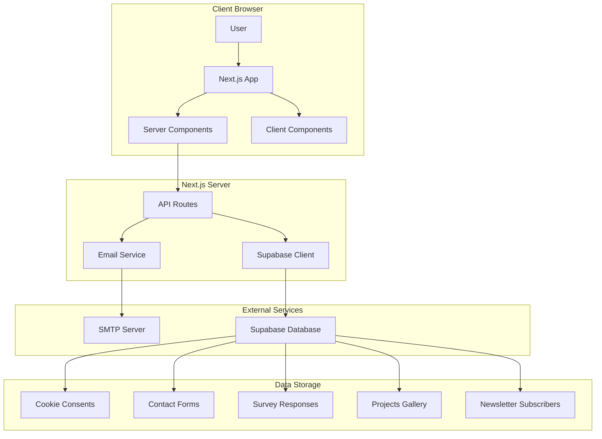
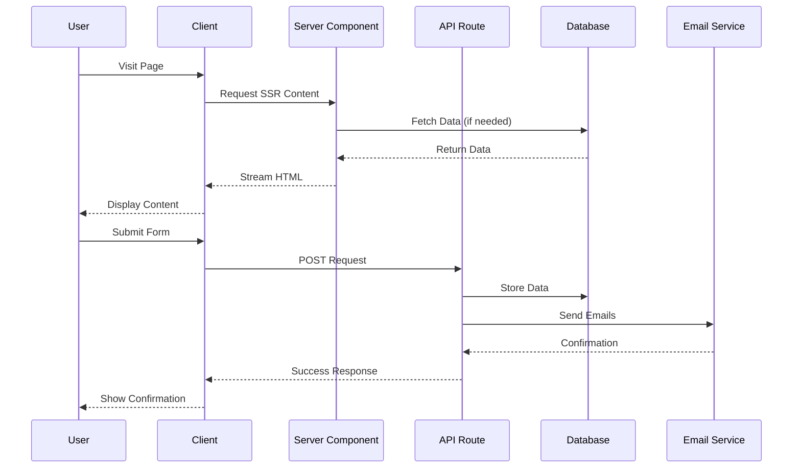

# Design Document

## Overview

This design document outlines the architecture and implementation strategy for enhancing the FredonBytes website with advanced user experience features. The implementation will leverage Next.js 15's App Router with a strong emphasis on Server-Side Rendering (SSR), next-intl for internationalization, Supabase for data persistence, and modern React patterns including Server Components, Suspense boundaries, and streaming.

### Key Design Principles

1. **Server-First Architecture**: Default to Server Components, use Client Components only when necessary
2. **Progressive Enhancement**: Core functionality works without JavaScript, enhanced with client-side features
3. **Type Safety**: Strict TypeScript throughout with Zod validation for runtime safety
4. **Performance**: Optimize for Core Web Vitals (LCP, FID, CLS) with streaming SSR and lazy loading
5. **Accessibility**: WCAG 2.1 Level AA compliance with semantic HTML and ARIA attributes
6. **Security**: Input sanitization, CSRF protection, RLS policies, and secure cookie handling

## Architecture

### High-Level System Architecture



### Application Flow



## Components and Interfaces

### 1. Cookie Consent System

#### Database Schema

```sql
CREATE TABLE cookie_consents (
  id UUID PRIMARY KEY DEFAULT gen_random_uuid(),
  session_id UUID NOT NULL UNIQUE,
  ip_address_hash TEXT NOT NULL, -- Anonymized via SHA-256
  user_agent TEXT,
  consent_timestamp TIMESTAMP WITH TIME ZONE DEFAULT NOW(),
  consent_version INTEGER NOT NULL DEFAULT 1,
  essential_cookies BOOLEAN NOT NULL DEFAULT true,
  analytics_cookies BOOLEAN NOT NULL DEFAULT false,
  marketing_cookies BOOLEAN NOT NULL DEFAULT false,
  preferences_cookies BOOLEAN NOT NULL DEFAULT false,
  created_at TIMESTAMP WITH TIME ZONE DEFAULT NOW(),
  updated_at TIMESTAMP WITH TIME ZONE DEFAULT NOW()
);

CREATE INDEX idx_cookie_consents_session_id ON cookie_consents(session_id);
CREATE INDEX idx_cookie_consents_timestamp ON cookie_consents(consent_timestamp);
```

#### Component Structure

**Server Components:**
- `CookieConsentWrapper` - Checks existing consent, renders banner conditionally

**Client Components:**
- `CookieConsentBanner` - Interactive banner with Accept/Reject/Customize buttons
- `CookieCustomizeModal` - Modal for granular cookie selection
- `CookieSettingsLink` - Footer link to reopen settings

#### TypeScript Interfaces

```typescript
interface CookieConsent {
  session_id: string;
  ip_address_hash: string;
  user_agent: string;
  consent_timestamp: Date;
  consent_version: number;
  essential_cookies: boolean;
  analytics_cookies: boolean;
  marketing_cookies: boolean;
  preferences_cookies: boolean;
}

interface CookiePreferences {
  essential: boolean;
  analytics: boolean;
  marketing: boolean;
  preferences: boolean;
}
```

#### API Endpoints

**POST /api/cookies/consent**
- Stores cookie preferences to database
- Returns: `{ success: boolean, session_id: string }`
- Validation: Zod schema for cookie preferences

**GET /api/cookies/consent?session_id={id}**
- Retrieves existing consent for session
- Returns: `CookieConsent | null`

#### Implementation Strategy

1. Use `cookies()` from `next/headers` to read/write consent cookie
2. Store minimal data in cookie: `{ session_id, version, timestamp }`
3. Full consent details stored in database
4. Check consent on middleware level for analytics script injection
5. Use `next/script` with `strategy="afterInteractive"` for conditional script loading

### 2. Enhanced Contact Form with Email Templates

#### Database Schema

```sql
CREATE TABLE contact_submissions (
  id UUID PRIMARY KEY DEFAULT gen_random_uuid(),
  session_id UUID NOT NULL UNIQUE,
  first_name TEXT NOT NULL,
  last_name TEXT NOT NULL,
  email TEXT NOT NULL,
  phone TEXT NOT NULL,
  company TEXT,
  project_type TEXT NOT NULL,
  budget TEXT NOT NULL,
  timeline TEXT NOT NULL,
  message TEXT NOT NULL,
  requirements JSONB,
  newsletter_opt_in BOOLEAN DEFAULT false,
  privacy_accepted BOOLEAN NOT NULL,
  locale TEXT NOT NULL DEFAULT 'en',
  ip_address_hash TEXT,
  user_agent TEXT,
  survey_sent BOOLEAN DEFAULT false,
  survey_completed BOOLEAN DEFAULT false,
  created_at TIMESTAMP WITH TIME ZONE DEFAULT NOW(),
  updated_at TIMESTAMP WITH TIME ZONE DEFAULT NOW()
);

CREATE TABLE newsletter_subscribers (
  id UUID PRIMARY KEY DEFAULT gen_random_uuid(),
  email TEXT NOT NULL UNIQUE,
  first_name TEXT,
  last_name TEXT,
  locale TEXT NOT NULL DEFAULT 'en',
  subscribed_at TIMESTAMP WITH TIME ZONE DEFAULT NOW(),
  unsubscribed_at TIMESTAMP WITH TIME ZONE,
  active BOOLEAN DEFAULT true,
  source TEXT DEFAULT 'contact_form',
  created_at TIMESTAMP WITH TIME ZONE DEFAULT NOW()
);

CREATE INDEX idx_contact_submissions_session_id ON contact_submissions(session_id);
CREATE INDEX idx_contact_submissions_email ON contact_submissions(email);
CREATE INDEX idx_newsletter_subscribers_email ON newsletter_subscribers(email);
```

#### Email Template System

**Template Structure:**
```typescript
interface EmailTemplate {
  subject: (data: EmailData, locale: Locale) => string;
  html: (data: EmailData, locale: Locale) => string;
  text: (data: EmailData, locale: Locale) => string;
}

interface EmailData {
  firstName: string;
  lastName: string;
  email: string;
  surveyLink?: string;
  [key: string]: unknown;
}
```

**Templates to Create:**
1. `customerConfirmationTemplate` - Sent to customer after contact form submission
2. `adminNotificationTemplate` - Sent to admin with contact details
3. `surveyInvitationTemplate` - Embedded in customer confirmation email

#### Component Structure

**Server Components:**
- `ContactFormWrapper` - Handles form submission via Server Actions

**Client Components:**
- `ContactForm` - Form with React Hook Form and Zod validation
- `FormField` - Reusable form field with error handling
- `FormSubmitButton` - Submit button with loading state

#### API Endpoints

**POST /api/contact/submit**
- Validates form data with Zod
- Stores submission to database
- Generates unique session_id for survey
- Sends two emails (customer + admin)
- Optionally adds to newsletter
- Returns: `{ success: boolean, session_id: string, message: string }`

### 3. Customer Satisfaction Survey System

#### Database Schema

```sql
CREATE TABLE survey_questions (
  id UUID PRIMARY KEY DEFAULT gen_random_uuid(),
  question_text JSONB NOT NULL, -- { en: "...", cs: "...", de: "..." }
  description JSONB,
  answer_type TEXT NOT NULL CHECK (answer_type IN ('short_text', 'long_text', 'single_choice', 'multiple_choice', 'checklist', 'rating')),
  required BOOLEAN NOT NULL DEFAULT false,
  display_order INTEGER NOT NULL,
  active BOOLEAN DEFAULT true,
  created_at TIMESTAMP WITH TIME ZONE DEFAULT NOW(),
  updated_at TIMESTAMP WITH TIME ZONE DEFAULT NOW(),
  UNIQUE(display_order)
);

CREATE TABLE survey_question_options (
  id UUID PRIMARY KEY DEFAULT gen_random_uuid(),
  question_id UUID NOT NULL REFERENCES survey_questions(id) ON DELETE CASCADE,
  option_text JSONB NOT NULL, -- { en: "...", cs: "...", de: "..." }
  display_order INTEGER NOT NULL,
  created_at TIMESTAMP WITH TIME ZONE DEFAULT NOW(),
  UNIQUE(question_id, display_order)
);

CREATE TABLE survey_sessions (
  session_id UUID PRIMARY KEY,
  contact_submission_id UUID REFERENCES contact_submissions(id),
  created_at TIMESTAMP WITH TIME ZONE DEFAULT NOW(),
  completed_at TIMESTAMP WITH TIME ZONE,
  ip_address_hash TEXT,
  user_agent TEXT,
  locale TEXT NOT NULL DEFAULT 'en'
);

CREATE TABLE survey_responses (
  id UUID PRIMARY KEY DEFAULT gen_random_uuid(),
  session_id UUID NOT NULL REFERENCES survey_sessions(session_id) ON DELETE CASCADE,
  question_id UUID NOT NULL REFERENCES survey_questions(id) ON DELETE CASCADE,
  answer_value JSONB NOT NULL,
  submitted_at TIMESTAMP WITH TIME ZONE DEFAULT NOW(),
  UNIQUE(session_id, question_id)
);

CREATE INDEX idx_survey_questions_display_order ON survey_questions(display_order);
CREATE INDEX idx_survey_question_options_question_id ON survey_question_options(question_id);
CREATE INDEX idx_survey_sessions_contact_id ON survey_sessions(contact_submission_id);
CREATE INDEX idx_survey_responses_session_id ON survey_responses(session_id);
```

#### Component Structure

**Server Components:**
- `SurveyPage` - Main survey page at `/survey/[session_id]/page.tsx`
- `SurveyWrapper` - Validates session and fetches questions

**Client Components:**
- `SurveyClient` - Multi-step form logic (reuse from `/form` implementation)
- `SurveyNavigation` - Progress indicator and navigation
- `SurveyQuestionStep` - Individual question rendering
- `SurveyThankYou` - Completion screen

#### API Endpoints

**GET /api/survey/questions?session_id={id}&locale={locale}**
- Validates session_id exists and is not completed
- Fetches survey questions with translations
- Returns: `{ questions: SurveyQuestion[], session: SurveySession }`

**POST /api/survey/submit**
- Validates session_id and responses
- Stores responses to database
- Marks session as completed
- Updates contact_submission.survey_completed
- Returns: `{ success: boolean, message: string }`

### 4. Next-Intl Integration

#### Migration Strategy

**Current State:**
- Custom i18n system with `src/app/lib/i18n.ts`
- JSON translation files in `src/app/locales/{locale}/common.json`
- `LocaleContext` for client-side locale management
- `useTranslations` custom hook

**Target State:**
- next-intl library for standardized i18n
- Structured message files with namespaces
- Server Component support with `getTranslations`
- Client Component support with `useTranslations` hook
- Type-safe translation keys

#### File Structure

```
src/
├── i18n/
│   ├── request.ts          # Request-scoped i18n config
│   └── routing.ts          # Routing configuration
├── messages/
│   ├── en/
│   │   ├── common.json
│   │   ├── contact.json
│   │   ├── survey.json
│   │   ├── cookies.json
│   │   └── projects.json
│   ├── cs/
│   │   └── ...
│   └── de/
│       └── ...
└── app/
    └── [locale]/
        ├── layout.tsx
        └── ...
```

#### Configuration

**i18n/request.ts:**
```typescript
import {getRequestConfig} from 'next-intl/server';
import {routing} from './routing';

export default getRequestConfig(async ({requestLocale}) => {
  let locale = await requestLocale;
  
  if (!locale || !routing.locales.includes(locale as any)) {
    locale = routing.defaultLocale;
  }

  return {
    locale,
    messages: (await import(`../messages/${locale}/common.json`)).default,
    timeZone: 'Europe/Prague',
    now: new Date()
  };
});
```

**i18n/routing.ts:**
```typescript
import {defineRouting} from 'next-intl/routing';

export const routing = defineRouting({
  locales: ['en', 'cs', 'de'],
  defaultLocale: 'en',
  localePrefix: 'as-needed'
});
```

**next.config.ts:**
```typescript
import createNextIntlPlugin from 'next-intl/plugin';

const withNextIntl = createNextIntlPlugin('./src/i18n/request.ts');

const nextConfig = {
  // existing config
};

export default withNextIntl(nextConfig);
```

#### Usage Patterns

**Server Components:**
```typescript
import {getTranslations} from 'next-intl/server';

export default async function ContactPage() {
  const t = await getTranslations('contact');
  return <h1>{t('title')}</h1>;
}
```

**Client Components:**
```typescript
'use client';
import {useTranslations} from 'next-intl';

export default function ContactForm() {
  const t = useTranslations('contact');
  return <button>{t('submit')}</button>;
}
```

**Email Templates:**
```typescript
import {getTranslations} from 'next-intl/server';

export async function generateCustomerEmail(locale: string, data: EmailData) {
  const t = await getTranslations({locale, namespace: 'emails.customer'});
  return {
    subject: t('subject'),
    html: generateHTML(t, data)
  };
}
```

### 5. SSR Optimization Strategy

#### Server Component Patterns

**Data Fetching:**
```typescript
// Cached data fetching
async function getProjects() {
  const res = await fetch('https://api.example.com/projects', {
    next: { revalidate: 3600 } // Cache for 1 hour
  });
  return res.json();
}

// Dynamic data (no cache)
async function getUserData() {
  const res = await fetch('https://api.example.com/user', {
    cache: 'no-store'
  });
  return res.json();
}
```

**Streaming with Suspense:**
```typescript
import { Suspense } from 'react';

export default function ProjectsPage() {
  return (
    <div>
      <h1>Projects</h1>
      <Suspense fallback={<ProjectsSkeleton />}>
        <ProjectsGrid />
      </Suspense>
    </div>
  );
}

async function ProjectsGrid() {
  const projects = await getProjects();
  return <div>{/* render projects */}</div>;
}
```

**Client Component Boundaries:**
```typescript
// Server Component (default)
export default async function Page() {
  const data = await getData();
  
  return (
    <div>
      <StaticContent data={data} />
      {/* Only interactive parts are Client Components */}
      <InteractiveForm />
    </div>
  );
}

// Client Component (minimal)
'use client';
export function InteractiveForm() {
  const [state, setState] = useState();
  // Interactive logic only
}
```

#### Dynamic Imports

**Conditional Client Components:**
```typescript
import dynamic from 'next/dynamic';

const CookieConsentBanner = dynamic(
  () => import('@/components/CookieConsentBanner'),
  { ssr: false } // Only load on client
);

const AnimatedGallery = dynamic(
  () => import('@/components/AnimatedGallery'),
  {
    loading: () => <GallerySkeleton />,
    ssr: true // SSR with loading state
  }
);
```

#### Script Loading Strategy

```typescript
import Script from 'next/script';

export function Analytics({ consent }: { consent: CookiePreferences }) {
  if (!consent.analytics) return null;
  
  return (
    <Script
      src="https://www.googletagmanager.com/gtag/js"
      strategy="afterInteractive"
      onLoad={() => {
        // Initialize analytics
      }}
    />
  );
}
```

### 6. Dynamic Project Gallery

#### Database Schema

```sql
CREATE TABLE projects (
  id UUID PRIMARY KEY DEFAULT gen_random_uuid(),
  title JSONB NOT NULL, -- { en: "...", cs: "...", de: "..." }
  description JSONB NOT NULL,
  short_description JSONB,
  image_url TEXT NOT NULL,
  github_link TEXT,
  live_demo_link TEXT,
  technologies JSONB NOT NULL, -- ["Next.js", "TypeScript", ...]
  status TEXT NOT NULL CHECK (status IN ('active', 'completed', 'archived')),
  display_order INTEGER NOT NULL,
  featured BOOLEAN DEFAULT false,
  visible BOOLEAN DEFAULT true,
  created_at TIMESTAMP WITH TIME ZONE DEFAULT NOW(),
  updated_at TIMESTAMP WITH TIME ZONE DEFAULT NOW(),
  UNIQUE(display_order)
);

CREATE INDEX idx_projects_display_order ON projects(display_order);
CREATE INDEX idx_projects_status ON projects(status);
CREATE INDEX idx_projects_featured ON projects(featured);
```

#### Component Structure

**Server Components:**
- `ProjectsGalleryPage` - Main gallery page
- `ProjectsGrid` - Grid layout with data fetching

**Client Components:**
- `ProjectCard` - Individual project card with hover animations
- `ProjectFilter` - Filter by technology/status
- `ProjectModal` - Detailed project view

#### TypeScript Interfaces

```typescript
interface Project {
  id: string;
  title: LocalizedString;
  description: LocalizedString;
  short_description: LocalizedString;
  image_url: string;
  github_link?: string;
  live_demo_link?: string;
  technologies: string[];
  status: 'active' | 'completed' | 'archived';
  display_order: number;
  featured: boolean;
  visible: boolean;
  created_at: Date;
  updated_at: Date;
}

interface LocalizedString {
  en: string;
  cs: string;
  de: string;
}
```

#### API Endpoints

**GET /api/projects?locale={locale}&status={status}**
- Fetches projects with translations
- Filters by status (optional)
- Orders by display_order
- Returns: `{ projects: Project[] }`

#### Animation Strategy

**Framer Motion Patterns:**
```typescript
'use client';
import { motion } from 'framer-motion';
import { useReducedMotion } from '@/hooks/useReducedMotion';

export function ProjectCard({ project }: { project: Project }) {
  const prefersReducedMotion = useReducedMotion();
  
  return (
    <motion.div
      initial={{ opacity: 0, y: prefersReducedMotion ? 0 : 20 }}
      animate={{ opacity: 1, y: 0 }}
      transition={{ duration: prefersReducedMotion ? 0 : 0.3 }}
      whileHover={prefersReducedMotion ? {} : { scale: 1.05 }}
    >
      {/* Card content */}
    </motion.div>
  );
}
```

**Performance Considerations:**
- Use `will-change` CSS property sparingly
- Implement intersection observer for lazy animation triggers
- Respect `prefers-reduced-motion` media query
- Use CSS transforms for better performance
- Limit simultaneous animations

## Data Models

### Consolidated Type Definitions

```typescript
// src/types/database.ts
export interface Database {
  public: {
    Tables: {
      cookie_consents: {
        Row: CookieConsent;
        Insert: Omit<CookieConsent, 'id' | 'created_at' | 'updated_at'>;
        Update: Partial<CookieConsent>;
      };
      contact_submissions: {
        Row: ContactSubmission;
        Insert: Omit<ContactSubmission, 'id' | 'created_at' | 'updated_at'>;
        Update: Partial<ContactSubmission>;
      };
      survey_questions: {
        Row: SurveyQuestion;
        Insert: Omit<SurveyQuestion, 'id' | 'created_at' | 'updated_at'>;
        Update: Partial<SurveyQuestion>;
      };
      projects: {
        Row: Project;
        Insert: Omit<Project, 'id' | 'created_at' | 'updated_at'>;
        Update: Partial<Project>;
      };
      // ... other tables
    };
  };
}
```

## Error Handling

### Error Handling Strategy

**Client-Side:**
```typescript
'use client';
export function ErrorBoundary({ error, reset }: ErrorBoundaryProps) {
  const t = useTranslations('errors');
  
  return (
    <div>
      <h2>{t('something_went_wrong')}</h2>
      <button onClick={reset}>{t('try_again')}</button>
    </div>
  );
}
```

**Server-Side:**
```typescript
export default async function Page() {
  try {
    const data = await fetchData();
    return <Content data={data} />;
  } catch (error) {
    console.error('Error fetching data:', error);
    return <ErrorState />;
  }
}
```

**API Routes:**
```typescript
export async function POST(request: NextRequest) {
  try {
    const body = await request.json();
    const validated = schema.parse(body);
    // Process request
    return NextResponse.json({ success: true });
  } catch (error) {
    if (error instanceof z.ZodError) {
      return NextResponse.json(
        { error: 'Validation failed', details: error.errors },
        { status: 400 }
      );
    }
    console.error('API error:', error);
    return NextResponse.json(
      { error: 'Internal server error' },
      { status: 500 }
    );
  }
}
```

## Testing Strategy

### Unit Testing
- Test utility functions with Jest
- Test Zod schemas with edge cases
- Test translation key existence
- Test email template generation

### Integration Testing
- Test API routes with mock database
- Test form submissions end-to-end
- Test email sending with mock SMTP
- Test cookie consent flow

### E2E Testing
- Test complete user flows with Playwright
- Test multi-language support
- Test responsive design on multiple devices
- Test accessibility with axe-core

### Performance Testing
- Lighthouse CI for Core Web Vitals
- Bundle size analysis
- Database query performance
- API response times

## Security Considerations

### Input Validation
- Zod schemas for all user inputs
- XSS prevention via React's built-in escaping
- SQL injection prevention via Supabase parameterized queries
- Rate limiting on API routes

### Data Privacy
- IP address anonymization (SHA-256 hash)
- GDPR compliance with cookie consent
- Data retention policies
- Right to deletion implementation

### Authentication & Authorization
- RLS policies on all Supabase tables
- API route protection with middleware
- CSRF token validation
- Secure cookie flags (httpOnly, secure, sameSite)

### Content Security Policy
```typescript
// next.config.ts
const cspHeader = `
  default-src 'self';
  script-src 'self' 'unsafe-eval' 'unsafe-inline' https://www.googletagmanager.com;
  style-src 'self' 'unsafe-inline';
  img-src 'self' blob: data: https:;
  font-src 'self';
  object-src 'none';
  base-uri 'self';
  form-action 'self';
  frame-ancestors 'none';
  upgrade-insecure-requests;
`;
```

## Deployment Strategy

### Environment Variables
```env
# Supabase
NEXT_PUBLIC_SUPABASE_URL=
NEXT_PUBLIC_SUPABASE_ANON_KEY=
SUPABASE_SERVICE_ROLE_KEY=

# Email
SMTP_HOST=
SMTP_PORT=
SMTP_USER=
SMTP_PASS=

# Site
NEXT_PUBLIC_SITE_URL=

# Analytics (conditional)
NEXT_PUBLIC_GA_ID=
```

### Build Optimization
- Static page generation where possible
- Image optimization with Next.js Image
- Font optimization with next/font
- Bundle analysis and code splitting
- CSS purging with Tailwind

### Monitoring
- Error tracking with Sentry (optional)
- Performance monitoring with Vercel Analytics
- Database query monitoring with Supabase
- Email delivery monitoring

## Migration Plan

### Phase 1: Foundation
1. Install and configure next-intl
2. Create database tables
3. Set up Supabase RLS policies
4. Migrate translation files

### Phase 2: Cookie Consent
1. Implement cookie consent components
2. Create API endpoints
3. Integrate with analytics scripts
4. Test GDPR compliance

### Phase 3: Contact Form Enhancement
1. Update contact form schema
2. Create email templates
3. Implement survey link generation
4. Add newsletter subscription

### Phase 4: Survey System
1. Create survey pages and routing
2. Implement survey components
3. Create API endpoints
4. Test end-to-end flow

### Phase 5: Project Gallery
1. Create projects table and seed data
2. Implement gallery components
3. Add animations and interactions
4. Optimize performance

### Phase 6: SSR Optimization
1. Audit current components
2. Convert to Server Components where possible
3. Implement Suspense boundaries
4. Add streaming SSR
5. Performance testing and optimization

## Performance Targets

- **Lighthouse Score**: 90+ across all metrics
- **First Contentful Paint (FCP)**: < 1.5s
- **Largest Contentful Paint (LCP)**: < 2.5s
- **Time to Interactive (TTI)**: < 3.5s
- **Cumulative Layout Shift (CLS)**: < 0.1
- **First Input Delay (FID)**: < 100ms
- **Bundle Size**: < 200KB (gzipped)
- **API Response Time**: < 500ms (p95)
- **Database Query Time**: < 100ms (p95)
