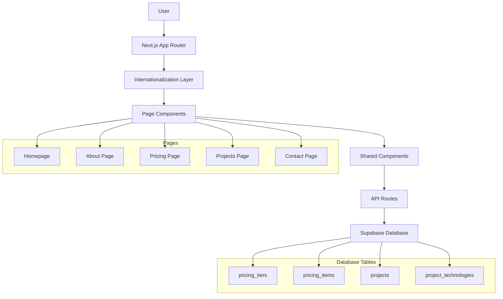
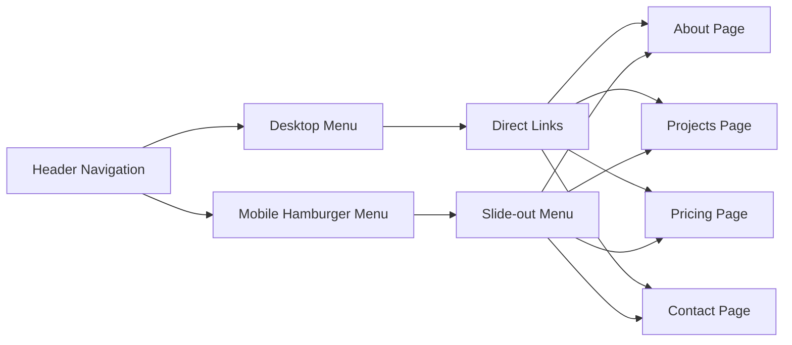

# Design Document

## Overview

This design document outlines the comprehensive refactoring of the Fredonbytes website to achieve full mobile responsiveness, enhanced user experience through dedicated pages, and improved functionality including a dynamic pricing system with database integration. The refactor addresses current mobile usability issues while implementing a modern, scalable architecture that supports the company's business goals.

## Architecture

### High-Level Architecture



### Mobile-First Responsive Design Strategy

The design follows a mobile-first approach with progressive enhancement:

1. **Base Design**: Mobile (320px+)
2. **Tablet Enhancement**: 768px+
3. **Desktop Enhancement**: 1024px+
4. **Large Desktop**: 1440px+

### Navigation Architecture



## Components and Interfaces

### Core Component Structure

#### 1. Enhanced Header Component
- **Mobile Navigation**: Functional hamburger menu with slide-out panel
- **Responsive Breakpoints**: Adaptive layout for all screen sizes
- **Touch Targets**: Minimum 44px touch targets for mobile
- **Accessibility**: Full keyboard navigation and screen reader support

#### 2. Homepage Refactoring
- **About Section**: Condensed overview with prominent CTA button
- **Pricing Section**: Three-tier preview with CTA to dedicated page
- **Projects Section**: Featured projects grid with CTA to full gallery
- **Contact Section**: Brief overview with CTA to dedicated page

#### 3. Dedicated Page Components

##### About Page (`/[locale]/about`)
- **Enhanced Content**: Comprehensive company information
- **Team Showcase**: Detailed team member profiles
- **Company Values**: Interactive values presentation
- **Mission & Vision**: Prominent display of company goals

##### Pricing Page (`/[locale]/pricing`)
- **Database Integration**: Dynamic pricing from Supabase
- **Multi-Currency Support**: CZK and EUR display
- **Three Pricing Tiers**: Starter, Professional, Enterprise
- **Interactive Calculator**: Enhanced pricing calculator
- **Comparison Table**: Feature comparison matrix

##### Projects Page (`/[locale]/projects`)
- **Gallery Interface**: Enhanced project showcase
- **Filtering System**: Technology and category filters
- **Project Details**: Expanded project information
- **GitHub Integration**: Direct repository links
- **Live Previews**: Project demonstration links

##### Contact Page (`/[locale]/contact`)
- **Multi-step Form**: Enhanced contact form experience
- **Contact Information**: Comprehensive contact details
- **Interactive Elements**: Improved form validation
- **Success States**: Clear feedback mechanisms

### Interface Definitions

#### Pricing System Interfaces

```typescript
interface PricingTier {
  id: string;
  name: string;
  description: string;
  type: 'starter' | 'professional' | 'enterprise';
  price_czk: number | null;
  price_eur: number | null;
  features: string[];
  popular: boolean;
  cta_text: string;
  created_at: string;
  updated_at: string;
}

interface PricingItem {
  id: string;
  name: string;
  description: string;
  base_price_czk: number;
  base_price_eur: number;
  category: string;
  features: string[];
  icon: string;
  active: boolean;
}
```

#### Project System Interfaces

```typescript
interface Project {
  id: string;
  title: string;
  description: string;
  image_url: string;
  category: string;
  technologies: string[];
  live_url?: string;
  github_url?: string;
  featured: boolean;
  created_at: string;
}

interface ProjectTechnology {
  id: string;
  name: string;
  icon: string;
  category: string;
}
```

## Data Models

### Database Schema

#### Pricing Tables

```sql
-- Pricing Tiers Table
CREATE TABLE pricing_tiers (
  id UUID PRIMARY KEY DEFAULT gen_random_uuid(),
  name JSONB NOT NULL, -- {en: "Professional", cs: "Profesionální", de: "Professionell"}
  description JSONB NOT NULL,
  type VARCHAR(20) NOT NULL CHECK (type IN ('starter', 'professional', 'enterprise')),
  price_czk INTEGER, -- Price in CZK (null for custom pricing)
  price_eur INTEGER, -- Price in EUR (null for custom pricing)
  features JSONB NOT NULL, -- Array of feature keys for translation
  popular BOOLEAN DEFAULT false,
  cta_text JSONB NOT NULL,
  active BOOLEAN DEFAULT true,
  created_at TIMESTAMP WITH TIME ZONE DEFAULT NOW(),
  updated_at TIMESTAMP WITH TIME ZONE DEFAULT NOW()
);

-- Pricing Items Table (for calculator)
CREATE TABLE pricing_items (
  id UUID PRIMARY KEY DEFAULT gen_random_uuid(),
  name JSONB NOT NULL,
  description JSONB NOT NULL,
  base_price_czk INTEGER NOT NULL,
  base_price_eur INTEGER NOT NULL,
  category VARCHAR(50) NOT NULL,
  features JSONB NOT NULL,
  icon VARCHAR(50) NOT NULL,
  active BOOLEAN DEFAULT true,
  created_at TIMESTAMP WITH TIME ZONE DEFAULT NOW(),
  updated_at TIMESTAMP WITH TIME ZONE DEFAULT NOW()
);
```

#### Projects Tables

```sql
-- Projects Table
CREATE TABLE projects (
  id UUID PRIMARY KEY DEFAULT gen_random_uuid(),
  title JSONB NOT NULL,
  description JSONB NOT NULL,
  image_url TEXT NOT NULL,
  category VARCHAR(50) NOT NULL,
  live_url TEXT,
  github_url TEXT,
  featured BOOLEAN DEFAULT false,
  active BOOLEAN DEFAULT true,
  created_at TIMESTAMP WITH TIME ZONE DEFAULT NOW(),
  updated_at TIMESTAMP WITH TIME ZONE DEFAULT NOW()
);

-- Project Technologies Junction Table
CREATE TABLE project_technologies (
  id UUID PRIMARY KEY DEFAULT gen_random_uuid(),
  project_id UUID REFERENCES projects(id) ON DELETE CASCADE,
  technology_name VARCHAR(100) NOT NULL,
  technology_icon VARCHAR(50),
  created_at TIMESTAMP WITH TIME ZONE DEFAULT NOW()
);

-- Technologies Reference Table
CREATE TABLE technologies (
  id UUID PRIMARY KEY DEFAULT gen_random_uuid(),
  name VARCHAR(100) UNIQUE NOT NULL,
  icon VARCHAR(50) NOT NULL,
  category VARCHAR(50) NOT NULL,
  color VARCHAR(20),
  created_at TIMESTAMP WITH TIME ZONE DEFAULT NOW()
);
```

### API Endpoints

#### Pricing API (`/api/pricing`)
- **GET /api/pricing/tiers**: Retrieve all pricing tiers
- **GET /api/pricing/items**: Retrieve pricing calculator items
- **GET /api/pricing/tiers/[id]**: Retrieve specific pricing tier

#### Projects API (`/api/projects`)
- **GET /api/projects**: Retrieve all projects with filtering
- **GET /api/projects/[id]**: Retrieve specific project
- **GET /api/projects/technologies**: Retrieve available technologies

## Error Handling

### Client-Side Error Handling

1. **Network Errors**: Graceful fallback to cached data or placeholder content
2. **API Failures**: User-friendly error messages with retry options
3. **Form Validation**: Real-time validation with clear error indicators
4. **Image Loading**: Placeholder images for failed loads

### Server-Side Error Handling

1. **Database Connection**: Fallback to static data when database unavailable
2. **API Rate Limiting**: Proper HTTP status codes and retry headers
3. **Validation Errors**: Structured error responses with field-specific messages
4. **Authentication**: Secure error messages without information leakage

### Mobile-Specific Error Handling

1. **Touch Interactions**: Visual feedback for all touch events
2. **Network Connectivity**: Offline state detection and messaging
3. **Performance**: Loading states for slow connections
4. **Viewport Issues**: Responsive layout error recovery

## Testing Strategy

### Responsive Design Testing

1. **Device Testing Matrix**:
   - Mobile: iPhone SE (375px), iPhone 12 (390px), Android (360px)
   - Tablet: iPad (768px), iPad Pro (1024px)
   - Desktop: 1280px, 1440px, 1920px

2. **Browser Testing**:
   - Chrome (mobile and desktop)
   - Safari (iOS and macOS)
   - Firefox (mobile and desktop)
   - Edge (desktop)

### Functionality Testing

1. **Navigation Testing**:
   - Hamburger menu functionality
   - Touch target accessibility
   - Keyboard navigation
   - Screen reader compatibility

2. **Form Testing**:
   - Multi-step form progression
   - Validation error handling
   - Mobile keyboard optimization
   - Touch-friendly inputs

3. **Database Integration Testing**:
   - Pricing data retrieval
   - Multi-language content
   - Currency conversion
   - Error state handling

### Performance Testing

1. **Mobile Performance**:
   - Core Web Vitals optimization
   - Image loading optimization
   - JavaScript bundle size
   - CSS delivery optimization

2. **Accessibility Testing**:
   - WCAG 2.1 AA compliance
   - Screen reader testing
   - Keyboard navigation
   - Color contrast validation

### Internationalization Testing

1. **Language Switching**:
   - Route preservation during language change
   - Content translation accuracy
   - RTL layout support (future consideration)
   - Currency localization

2. **Content Testing**:
   - Translation key coverage
   - Dynamic content translation
   - Database content localization
   - Error message translation

## Implementation Phases

### Phase 1: Mobile Responsiveness Foundation
1. Fix mobile navigation issues
2. Implement responsive layouts
3. Optimize touch interactions
4. Ensure content visibility on mobile

### Phase 2: Page Structure Refactoring
1. Create dedicated page layouts
2. Implement CTA button routing
3. Refactor homepage sections
4. Update navigation structure

### Phase 3: Database Integration
1. Create pricing database schema
2. Implement pricing API endpoints
3. Build dynamic pricing components
4. Add multi-currency support

### Phase 4: Enhanced Features
1. Implement project gallery
2. Add filtering and search
3. Enhance contact forms
4. Optimize performance

### Phase 5: Testing and Optimization
1. Comprehensive responsive testing
2. Performance optimization
3. Accessibility validation
4. Internationalization verification

## Technical Considerations

### Performance Optimization

1. **Image Optimization**:
   - Next.js Image component usage
   - WebP format with fallbacks
   - Responsive image sizing
   - Lazy loading implementation

2. **Code Splitting**:
   - Dynamic imports for heavy components
   - Route-based code splitting
   - Component-level lazy loading
   - Bundle size optimization

3. **Caching Strategy**:
   - Static page generation where possible
   - API response caching
   - Image caching optimization
   - Browser caching headers

### Security Considerations

1. **Database Security**:
   - Row Level Security (RLS) policies
   - Input sanitization
   - SQL injection prevention
   - API rate limiting

2. **Form Security**:
   - CSRF protection
   - Input validation
   - XSS prevention
   - Secure data transmission

### Accessibility Compliance

1. **WCAG 2.1 AA Standards**:
   - Semantic HTML structure
   - Proper heading hierarchy
   - Alt text for images
   - Keyboard navigation support

2. **Mobile Accessibility**:
   - Touch target sizing (44px minimum)
   - Screen reader optimization
   - Voice control compatibility
   - Gesture-based navigation

This design provides a comprehensive foundation for implementing the mobile-responsive refactor while maintaining scalability, performance, and user experience standards.