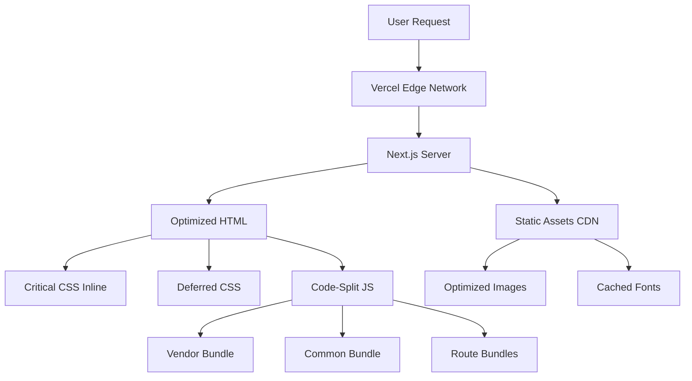

# Design Document: Performance Optimization

## Overview

This design document outlines a comprehensive performance optimization strategy for the FredonBytes website. The optimization focuses on achieving Lighthouse scores of 95+ while ensuring cross-browser compatibility, eliminating code duplication, and implementing modern best practices for fast loading across all devices.

## Architecture

### Current State Analysis

**Existing Optimizations:**
- Next.js 15.3.3 with App Router (Server Components by default)
- Image optimization with WebP/AVIF formats
- Code splitting for Framer Motion
- Console log removal in production
- Security headers configured
- Standalone output mode

**Areas for Improvement:**
- CSS vendor prefixes for cross-browser compatibility
- Unused code and duplicate code removal
- Enhanced bundle optimization
- Critical CSS extraction
- Font loading optimization
- Additional performance monitoring

### Target Architecture



## Components and Interfaces

### 1. Code Analysis and Cleanup Module

**Purpose:** Identify and remove unused code, duplicates, and optimize imports.

**Components:**

#### 1.1 Unused Code Detector
```typescript
interface UnusedCodeAnalysis {
  unusedImports: string[];
  unusedComponents: string[];
  unusedUtilities: string[];
  unusedTypes: string[];
  duplicateCode: CodeDuplicate[];
}

interface CodeDuplicate {
  files: string[];
  codeBlock: string;
  lineNumbers: number[];
}
```

**Implementation Strategy:**
- Use TypeScript compiler API to detect unused imports
- Analyze component usage across the codebase
- Identify duplicate utility functions
- Remove unused CSS classes

#### 1.2 Dependency Optimizer
```typescript
interface DependencyAnalysis {
  unusedPackages: string[];
  outdatedPackages: PackageUpdate[];
  bundleImpact: Map<string, number>;
}
```

**Actions:**
- Audit package.json for unused dependencies
- Check for duplicate dependencies in node_modules
- Analyze bundle size impact of each package

### 2. CSS Optimization Module

**Purpose:** Ensure cross-browser compatibility and optimize CSS delivery.

#### 2.1 Vendor Prefix Manager

**CSS Properties Requiring Prefixes:**

```css
/* Flexbox - Safari 8-, IE 10 */
.flex-container {
  display: -webkit-box;
  display: -webkit-flex;
  display: -ms-flexbox;
  display: flex;
}

/* Grid - IE 10-11 */
.grid-container {
  display: -ms-grid;
  display: grid;
}

/* Transforms - Safari 8-, IE 9 */
.transform {
  -webkit-transform: translateX(0);
  -moz-transform: translateX(0);
  -ms-transform: translateX(0);
  transform: translateX(0);
}

/* Animations - Safari 8-, Chrome 42- */
@-webkit-keyframes fadeIn {
  from { opacity: 0; }
  to { opacity: 1; }
}
@keyframes fadeIn {
  from { opacity: 0; }
  to { opacity: 1; }
}

/* Backdrop Filter - Safari 9+ */
.backdrop {
  -webkit-backdrop-filter: blur(10px);
  backdrop-filter: blur(10px);
}

/* User Select - Safari, Firefox */
.no-select {
  -webkit-user-select: none;
  -moz-user-select: none;
  -ms-user-select: none;
  user-select: none;
}

/* Appearance - Safari, Firefox */
.custom-input {
  -webkit-appearance: none;
  -moz-appearance: none;
  appearance: none;
}

/* Scrollbar - Webkit browsers */
.custom-scroll::-webkit-scrollbar {
  width: 8px;
}

/* Smooth Scrolling - Safari */
.smooth-scroll {
  -webkit-overflow-scrolling: touch;
}
```

**PostCSS Configuration:**
```javascript
// postcss.config.mjs
export default {
  plugins: {
    '@tailwindcss/postcss': {},
    'autoprefixer': {
      overrideBrowserslist: [
        'last 2 Chrome versions',
        'last 2 Firefox versions',
        'last 2 Safari versions',
        'last 2 Edge versions',
        'iOS >= 14',
        'Android >= 10'
      ],
      grid: 'autoplace'
    },
    'cssnano': {
      preset: ['default', {
        discardComments: { removeAll: true },
        normalizeWhitespace: true,
        minifyFontValues: true,
        minifySelectors: true
      }]
    }
  }
}
```

#### 2.2 Critical CSS Extraction

**Strategy:**
- Extract above-the-fold CSS for each route
- Inline critical CSS in HTML head
- Defer non-critical CSS loading
- Use Critters (already installed) for automatic extraction

**Implementation:**
```typescript
// next.config.ts enhancement
experimental: {
  optimizeCss: true, // Already enabled
  // Critters will automatically inline critical CSS
}
```

#### 2.3 CSS Purging

**Tailwind Configuration:**
```typescript
// tailwind.config.ts
export default {
  content: [
    './src/app/**/*.{js,ts,jsx,tsx,mdx}',
    './src/components/**/*.{js,ts,jsx,tsx,mdx}',
  ],
  // Tailwind 4 automatically purges unused classes
  safelist: [
    // Dynamically generated classes
    'animate-bounce-in',
    'animate-fade-in',
    'animate-slide-up',
    'animate-scale-in',
  ]
}
```

### 3. JavaScript Bundle Optimization Module

**Purpose:** Minimize JavaScript bundle size and optimize loading.

#### 3.1 Enhanced Code Splitting

**Current Configuration (to enhance):**
```typescript
// next.config.ts - webpack optimization
webpack: (config, { isServer }) => {
  if (!isServer) {
    config.optimization.splitChunks = {
      chunks: 'all',
      cacheGroups: {
        // Framework code (React, Next.js)
        framework: {
          name: 'framework',
          test: /[\\/]node_modules[\\/](react|react-dom|next)[\\/]/,
          priority: 40,
          enforce: true,
        },
        // Large libraries
        framerMotion: {
          name: 'framer-motion',
          test: /[\\/]node_modules[\\/]framer-motion[\\/]/,
          priority: 35,
        },
        radixUI: {
          name: 'radix-ui',
          test: /[\\/]node_modules[\\/]@radix-ui[\\/]/,
          priority: 30,
        },
        // Vendor code
        vendor: {
          name: 'vendor',
          test: /[\\/]node_modules[\\/]/,
          priority: 20,
        },
        // Common shared code
        common: {
          name: 'common',
          minChunks: 2,
          priority: 10,
          reuseExistingChunk: true,
        },
      },
    };
  }
  return config;
}
```

#### 3.2 Dynamic Imports Strategy

**Components to Lazy Load:**
```typescript
// Heavy components that should be dynamically imported
const componentsToLazyLoad = [
  'AnimatedBackground',      // Framer Motion animations
  'CookieConsentBanner',    // Not needed immediately
  'LanguageSwitcher',       // Can load after initial render
  'ContactSection',         // Below the fold
  'ProjectsSection',        // Below the fold
  'PricingSection',         // Below the fold
];

// Example implementation
const AnimatedBackground = dynamic(
  () => import('@/components/common/AnimatedBackground'),
  { 
    ssr: false,
    loading: () => <div className="animate-pulse bg-muted" />
  }
);
```

#### 3.3 Tree Shaking Optimization

**Package Import Optimization:**
```typescript
// next.config.ts
experimental: {
  optimizePackageImports: [
    'lucide-react',
    'framer-motion',
    '@radix-ui/react-accordion',
    '@radix-ui/react-dialog',
    '@radix-ui/react-dropdown-menu',
    '@radix-ui/react-navigation-menu',
    '@radix-ui/react-scroll-area',
    '@radix-ui/react-separator',
    '@radix-ui/react-slot',
    '@radix-ui/react-tabs',
    '@radix-ui/react-tooltip',
    'date-fns',
  ],
}
```

### 4. Image Optimization Module

**Purpose:** Optimize image loading and delivery.

#### 4.1 Image Component Standards

**Configuration (already optimized):**
```typescript
// next.config.ts
images: {
  formats: ['image/webp', 'image/avif'],
  deviceSizes: [640, 768, 1024, 1280, 1536],
  imageSizes: [16, 32, 48, 64, 96, 128, 256, 384],
  minimumCacheTTL: 60 * 60 * 24 * 7, // 7 days
}
```

**Usage Pattern:**
```typescript
// Priority for above-the-fold images
<Image
  src="/hero-image.jpg"
  alt="Hero"
  width={1920}
  height={1080}
  priority
  quality={85}
  sizes="100vw"
/>

// Lazy loading for below-the-fold images
<Image
  src="/project-image.jpg"
  alt="Project"
  width={800}
  height={600}
  loading="lazy"
  quality={75}
  sizes="(max-width: 768px) 100vw, (max-width: 1200px) 50vw, 33vw"
/>
```

#### 4.2 Image Audit

**Actions:**
- Identify all images in public/ directory
- Ensure all images use Next.js Image component
- Replace any  tags with <Image>
- Verify appropriate sizes and quality settings

### 5. Font Optimization Module

**Purpose:** Optimize font loading to prevent FOIT/FOUT.

#### 5.1 Font Loading Strategy

**Next.js Font Optimization:**
```typescript
// src/app/layout.tsx
import { Inter } from 'next/font/google';

const inter = Inter({
  subsets: ['latin', 'latin-ext'], // For Czech characters
  display: 'swap', // Prevent FOIT
  preload: true,
  variable: '--font-inter',
  fallback: ['system-ui', 'arial'],
});

export default function RootLayout({ children }) {
  return (
    <html lang="en" className={inter.variable}>
      <body className="font-sans">{children}</body>
    </html>
  );
}
```

**CSS Configuration:**
```css
/* globals.css */
@layer base {
  :root {
    --font-sans: var(--font-inter), system-ui, -apple-system, sans-serif;
  }
  
  body {
    font-family: var(--font-sans);
    font-display: swap;
  }
}
```

### 6. Performance Monitoring Module

**Purpose:** Measure and track performance metrics.

#### 6.1 Web Vitals Tracking

**Implementation:**
```typescript
// src/app/components/WebVitals.tsx
'use client';

import { useReportWebVitals } from 'next/web-vitals';

export function WebVitals() {
  useReportWebVitals((metric) => {
    // Log to console in development
    if (process.env.NODE_ENV === 'development') {
      console.log(metric);
    }
    
    // Send to analytics in production
    if (process.env.NODE_ENV === 'production') {
      // Example: send to analytics service
      const body = JSON.stringify(metric);
      const url = '/api/analytics';
      
      if (navigator.sendBeacon) {
        navigator.sendBeacon(url, body);
      } else {
        fetch(url, { body, method: 'POST', keepalive: true });
      }
    }
  });
  
  return null;
}
```

#### 6.2 Lighthouse CI Integration

**Configuration:**
```json
// .lighthouserc.json
{
  "ci": {
    "collect": {
      "numberOfRuns": 3,
      "url": [
        "http://localhost:3000/",
        "http://localhost:3000/links",
        "http://localhost:3000/form"
      ]
    },
    "assert": {
      "preset": "lighthouse:recommended",
      "assertions": {
        "categories:performance": ["error", {"minScore": 0.95}],
        "categories:accessibility": ["error", {"minScore": 0.95}],
        "categories:best-practices": ["error", {"minScore": 0.95}],
        "categories:seo": ["error", {"minScore": 0.95}],
        "first-contentful-paint": ["error", {"maxNumericValue": 1500}],
        "largest-contentful-paint": ["error", {"maxNumericValue": 2000}],
        "cumulative-layout-shift": ["error", {"maxNumericValue": 0.1}],
        "total-blocking-time": ["error", {"maxNumericValue": 150}]
      }
    }
  }
}
```

### 7. Browser Compatibility Module

**Purpose:** Ensure consistent experience across browsers.

#### 7.1 Browserslist Configuration

**Package.json addition:**
```json
{
  "browserslist": [
    "last 2 Chrome versions",
    "last 2 Firefox versions",
    "last 2 Safari versions",
    "last 2 Edge versions",
    "iOS >= 14",
    "Android >= 10",
    "not dead",
    "not op_mini all"
  ]
}
```

#### 7.2 Polyfills Strategy

**Next.js handles most polyfills automatically, but for specific features:**
```typescript
// src/app/polyfills.ts (if needed)
if (typeof window !== 'undefined') {
  // Intersection Observer polyfill for older browsers
  if (!('IntersectionObserver' in window)) {
    import('intersection-observer');
  }
  
  // ResizeObserver polyfill
  if (!('ResizeObserver' in window)) {
    import('resize-observer-polyfill');
  }
}
```

### 8. Caching Strategy Module

**Purpose:** Optimize caching for faster subsequent loads.

#### 8.1 Cache Headers (already configured)

**Current configuration is good:**
```typescript
// next.config.ts - headers()
{
  source: "/:path*.{ico,png,jpg,jpeg,gif,webp,svg,woff,woff2}",
  headers: [
    {
      key: "Cache-Control",
      value: "public, max-age=31536000, immutable",
    },
  ],
}
```

#### 8.2 Service Worker (Optional Enhancement)

**For offline support and advanced caching:**
```typescript
// next.config.ts
const withPWA = require('next-pwa')({
  dest: 'public',
  disable: process.env.NODE_ENV === 'development',
  register: true,
  skipWaiting: true,
});

module.exports = withPWA(nextConfig);
```

## Data Models

### Performance Metrics Model

```typescript
interface PerformanceMetrics {
  // Core Web Vitals
  lcp: number;  // Largest Contentful Paint
  fid: number;  // First Input Delay
  cls: number;  // Cumulative Layout Shift
  fcp: number;  // First Contentful Paint
  ttfb: number; // Time to First Byte
  tti: number;  // Time to Interactive
  tbt: number;  // Total Blocking Time
  
  // Bundle sizes
  bundleSizes: {
    total: number;
    javascript: number;
    css: number;
    images: number;
    fonts: number;
  };
  
  // Lighthouse scores
  lighthouse: {
    performance: number;
    accessibility: number;
    bestPractices: number;
    seo: number;
  };
  
  // Browser info
  browser: {
    name: string;
    version: string;
    platform: string;
  };
  
  timestamp: Date;
}
```

### Code Analysis Model

```typescript
interface CodeAnalysisResult {
  files: {
    total: number;
    analyzed: number;
    modified: number;
  };
  
  removals: {
    unusedImports: number;
    unusedComponents: number;
    unusedUtilities: number;
    duplicateCode: number;
    unusedDependencies: string[];
  };
  
  optimizations: {
    bundleSizeReduction: number; // in KB
    cssReduction: number;        // in KB
    imageOptimization: number;   // in KB
  };
  
  modernization: {
    arrowFunctionsConverted: number;
    asyncAwaitConverted: number;
    optionalChainingAdded: number;
  };
}
```

## Error Handling

### Build-Time Errors

```typescript
// Handle build failures gracefully
try {
  // Optimization process
} catch (error) {
  console.error('Optimization failed:', error);
  // Continue with build, log warning
  process.exitCode = 0; // Don't fail build
}
```

### Runtime Performance Monitoring

```typescript
// Monitor performance degradation
if (metric.value > threshold) {
  console.warn(`Performance threshold exceeded: ${metric.name}`);
  // Log to monitoring service
}
```

### Browser Compatibility Fallbacks

```css
/* CSS fallbacks */
.gradient-bg {
  background: #0f172a; /* Fallback */
  background: linear-gradient(135deg, #0f172a 0%, #1e293b 100%);
}

/* Feature detection */
@supports (backdrop-filter: blur(10px)) {
  .glass-effect {
    backdrop-filter: blur(10px);
  }
}

@supports not (backdrop-filter: blur(10px)) {
  .glass-effect {
    background: rgba(255, 255, 255, 0.9);
  }
}
```

## Testing Strategy

### 1. Performance Testing

**Tools:**
- Lighthouse CI (automated)
- WebPageTest (manual)
- Chrome DevTools Performance panel
- Next.js Bundle Analyzer

**Test Cases:**
```bash
# Build and analyze bundle
ANALYZE=true npm run build

# Run Lighthouse CI
npm run lighthouse

# Test on different devices
# - Desktop (1920x1080)
# - Tablet (768x1024)
# - Mobile (375x667)

# Test on different networks
# - Fast 3G
# - Slow 3G
# - Offline (if PWA implemented)
```

### 2. Browser Compatibility Testing

**Manual Testing Matrix:**
| Browser | Version | Desktop | Mobile | Priority |
|---------|---------|---------|--------|----------|
| Chrome  | Latest 2| ✓       | ✓      | High     |
| Firefox | Latest 2| ✓       | ✓      | High     |
| Safari  | Latest 2| ✓       | ✓      | High     |
| Edge    | Latest 2| ✓       | ✓      | Medium   |

**Automated Testing:**
```typescript
// Use Playwright for cross-browser testing
import { test, expect } from '@playwright/test';

test.describe('Cross-browser compatibility', () => {
  test('renders correctly in Chrome', async ({ page }) => {
    await page.goto('/');
    await expect(page).toHaveScreenshot();
  });
  
  test('renders correctly in Firefox', async ({ page }) => {
    await page.goto('/');
    await expect(page).toHaveScreenshot();
  });
  
  test('renders correctly in Safari', async ({ page }) => {
    await page.goto('/');
    await expect(page).toHaveScreenshot();
  });
});
```

### 3. Visual Regression Testing

**Tools:**
- Percy or Chromatic for visual diffs
- Playwright screenshots

### 4. Code Quality Testing

```bash
# Type checking
npm run type-check

# Linting
npm run lint

# Unused code detection
npx depcheck

# Bundle size analysis
npm run build:analyze
```

## Implementation Phases

### Phase 1: Code Cleanup (Foundation)
- Remove unused imports and code
- Eliminate duplicate code
- Remove unused dependencies
- Modernize code syntax

### Phase 2: CSS Optimization
- Add vendor prefixes (autoprefixer)
- Implement critical CSS extraction
- Optimize Tailwind configuration
- Add cross-browser CSS fixes

### Phase 3: JavaScript Optimization
- Enhanced code splitting
- Dynamic imports for heavy components
- Tree shaking optimization
- Bundle analysis and optimization

### Phase 4: Asset Optimization
- Image audit and optimization
- Font loading optimization
- Static asset caching

### Phase 5: Monitoring and Testing
- Web Vitals tracking
- Lighthouse CI setup
- Browser compatibility testing
- Performance benchmarking

## Success Criteria

### Performance Targets

| Metric | Target | Current | Priority |
|--------|--------|---------|----------|
| Lighthouse Performance | ≥ 95 | ~90 | High |
| FCP | < 1.5s | ~1.8s | High |
| LCP | < 2.0s | ~2.5s | High |
| TTI | < 3.0s | ~3.8s | Medium |
| CLS | < 0.1 | ~0.1 | Low |
| TBT | < 150ms | ~200ms | Medium |
| Bundle Size | < 200KB | ~250KB | High |

### Browser Support

- Chrome/Edge: Last 2 versions ✓
- Firefox: Last 2 versions ✓
- Safari: Last 2 versions ✓
- iOS Safari: 14+ ✓
- Chrome Mobile: Android 10+ ✓

### Code Quality

- Zero unused imports ✓
- Zero duplicate code blocks ✓
- Zero unused dependencies ✓
- 100% TypeScript strict mode ✓
- All modern ES6+ syntax ✓

## Dependencies

### New Dependencies to Add

```json
{
  "devDependencies": {
    "autoprefixer": "^10.4.20",
    "cssnano": "^7.0.6",
    "@next/bundle-analyzer": "^15.3.3",
    "lighthouse": "^12.2.1",
    "@lhci/cli": "^0.14.0",
    "depcheck": "^1.4.7"
  }
}
```

### Dependencies to Remove (if unused)

To be determined after dependency audit:
- `appwrite` (if not used)
- `next-intl` (using custom i18n)
- `@appwrite.io/pink-icons` (if not used)

## Risks and Mitigations

### Risk 1: Breaking Changes from Vendor Prefixes
**Mitigation:** Test thoroughly in all target browsers before deployment

### Risk 2: Bundle Size Increase from Polyfills
**Mitigation:** Use conditional loading, only load polyfills when needed

### Risk 3: Performance Regression from Over-Optimization
**Mitigation:** Measure before and after, rollback if metrics worsen

### Risk 4: Build Time Increase
**Mitigation:** Optimize build process, use caching, parallel processing

## Rollback Strategy

1. Keep git history clean with atomic commits
2. Tag current version before optimization
3. Monitor metrics post-deployment
4. Have rollback plan ready if metrics degrade
5. Use feature flags for gradual rollout

## Future Enhancements

1. **Progressive Web App (PWA)**
   - Service worker for offline support
   - App manifest for installability

2. **Advanced Caching**
   - Stale-while-revalidate strategy
   - Predictive prefetching

3. **Image Optimization**
   - Responsive images with art direction
   - Lazy loading with intersection observer

4. **Performance Budget**
   - Automated bundle size limits
   - Performance regression alerts

5. **Edge Computing**
   - Edge functions for dynamic content
   - Geolocation-based optimization
