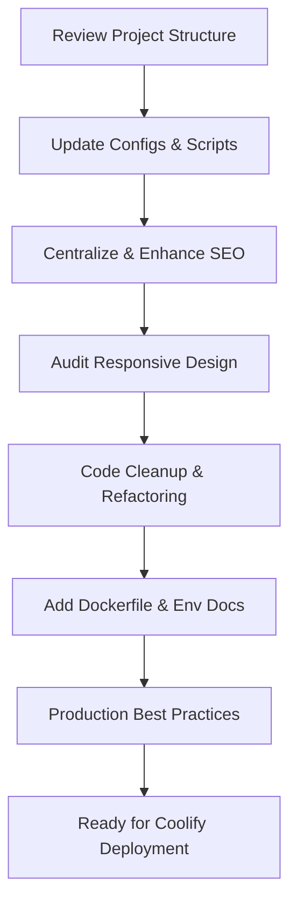

# Coolify Deployment Optimization Plan (Maximum Technical Detail)

---

## 1. Project Structure & Configuration

### Checklist & Implementation Notes

- **Directory Structure**

  - Ensure `/src` contains `app`, `components`, `hooks`, `lib`, `contexts`, and `locales`.
  - Move utility functions to `/src/app/lib`.
  - Place global styles in `/src/app/globals.css`.
  - Keep `/public` for static assets only.

- **next.config.ts**

  - Enable image optimization:
    ```ts
    images: { domains: ['yourdomain.com'], formats: ['image/webp'] }
    ```
  - Add security headers:
    ```ts
    async headers() {
      return [
        {
          source: '/(.*)',
          headers: [
            { key: 'X-Frame-Options', value: 'SAMEORIGIN' },
            { key: 'X-Content-Type-Options', value: 'nosniff' },
            { key: 'Referrer-Policy', value: 'strict-origin-when-cross-origin' },
          ],
        },
      ];
    }
    ```
  - Enable compression:
    ```ts
    compress: true;
    ```
  - Set up i18n if needed.

- **tsconfig.json**

  - Enable strict mode:
    ```json
    "strict": true
    ```
  - Use path aliases:
    ```json
    "paths": {
      "@components/*": ["./src/app/components/*"],
      "@lib/*": ["./src/app/lib/*"]
    }
    ```

- **eslint.config.mjs**

  - Use `@next/eslint-plugin-next` and `@typescript-eslint`.
  - Integrate Prettier:
    ```js
    extends: ['next', 'plugin:@typescript-eslint/recommended', 'prettier']
    ```

- **package.json**
  - Scripts:
    ```json
    "scripts": {
      "dev": "next dev",
      "build": "next build",
      "start": "next start",
      "lint": "next lint",
      "type-check": "tsc --noEmit",
      "pre-commit": "npm run lint && npm run type-check",
      "pre-deploy": "npm run pre-commit && npm run build"
    }
    ```

---

## 2. SEO & Indexing

### Checklist & Implementation Notes

- **Centralize SEO**

  - Use [`SEOHead.tsx`](src/app/components/common/SEOHead.tsx:13) for all custom meta tags.
  - Example usage:
    ```tsx
    <SEOHead
      title="Page Title"
      description="Page description"
      ogImage="/og-image.png"
      canonical="https://yourdomain.com/page"
      twitterCard="summary_large_image"
    />
    ```

- **Open Graph & Twitter Cards**

  - Set `og:title`, `og:description`, `og:image`, `og:url`, `twitter:card`, `twitter:title`, `twitter:description`, `twitter:image`.
  - Use dynamic values per page.

- **Canonical URLs**

  - Always set `<link rel="canonical" href="..." />` for each page.

- **robots.txt & sitemap.xml**

  - Place in `/public`.
  - Example `robots.txt`:
    ```
    User-agent: *
    Allow: /
    Sitemap: https://yourdomain.com/sitemap.xml
    ```
  - Generate `sitemap.xml` using a script or Next.js API route.

- **hreflang for Multilingual**

  - Add alternate links for each locale:
    ```html
    <link rel="alternate" href="https://yourdomain.com/en" hreflang="en" />
    <link rel="alternate" href="https://yourdomain.com/cs" hreflang="cs" />
    ```

- **Validation**
  - Use [Open Graph Debugger](https://ogp.me/), [Twitter Card Validator](https://cards-dev.twitter.com/validator), and [Google Search Console](https://search.google.com/search-console).

---

## 3. Responsive Design

### Checklist & Implementation Notes

- **Tailwind CSS**

  - Use responsive classes: `sm:`, `md:`, `lg:`, `xl:`, `2xl:`.
  - Example:
    ```tsx
    <div className="p-4 sm:p-6 lg:p-8" />
    ```

- **Media Queries**

  - For custom CSS, use `@media` in `globals.css`:
    ```css
    @media (max-width: 640px) {
      ...;
    }
    ```

- **Layout Testing**

  - Test with Chrome DevTools device toolbar.
  - Use [Lighthouse](https://developers.google.com/web/tools/lighthouse) for mobile/desktop audits.

- **Accessibility**
  - Ensure color contrast meets WCAG AA.
  - All interactive elements must be keyboard accessible.
  - Use semantic HTML and ARIA attributes.
  - Test with [axe DevTools](https://www.deque.com/axe/devtools/).

---

## 4. Code Cleanup & Maintainability

### Checklist & Implementation Notes

- **Unused Files**

  - Use `ts-prune` or `depcheck` to find unused exports/dependencies.
  - Manually review `/src`, `/public`, `/scripts` for obsolete files.

- **Dependencies**

  - Run `npm prune` and `npm outdated`.
  - Remove unused packages with `npm uninstall`.

- **Refactoring**

  - Split large components into smaller ones.
  - Use hooks for shared logic.
  - Prefer functional components and TypeScript types/interfaces.

- **Documentation**

  - Add JSDoc or TypeScript comments to all exported functions.
  - Document architecture and decisions in `/docs/ARCHITECTURE.md`.

- **Quality Gates**
  - Ensure all code passes:
    - `npm run lint`
    - `npm run type-check`
    - Unit tests (if present)

---

## 5. Coolify Deployment Optimization

### Checklist & Implementation Notes

- **Dockerfile (multi-stage)**

  ```Dockerfile
  # Stage 1: Build
  FROM node:20-alpine AS builder
  WORKDIR /app
  COPY . .
  RUN npm ci
  RUN npm run build

  # Stage 2: Production
  FROM node:20-alpine
  WORKDIR /app
  ENV NODE_ENV=production
  COPY --from=builder /app/.next ./.next
  COPY --from=builder /app/public ./public
  COPY --from=builder /app/package.json ./package.json
  COPY --from=builder /app/node_modules ./node_modules
  EXPOSE 3000
  CMD ["npm", "start"]
  ```

- **.dockerignore**

  ```
  node_modules
  npm-debug.log
  Dockerfile
  .dockerignore
  .git
  .github
  .env*
  /src/**/*.test.*
  /docs
  ```

- **Environment Variables**

  - Document all required variables in `.env.example`:
    ```
    NEXT_PUBLIC_API_URL=https://api.yourdomain.com
    NEXTAUTH_SECRET=your-secret
    ```
  - Use `process.env` in code, never hardcode secrets.

- **Coolify Notes**
  - Set health checks to `/api/health` if available.
  - Use Coolify's UI to map environment variables and persistent storage.
  - Ensure `start` and `build` scripts are compatible with container.

---

## 6. Production Best Practices

### Checklist & Implementation Notes

- **Image Optimization**

  - Use Next.js `<Image />` for all images.
  - Configure allowed domains in `next.config.ts`.

- **Compression & Caching**

  - Enable `compress: true` in Next.js config.
  - Set cache headers for static assets in `next.config.ts`:
    ```ts
    async headers() {
      return [
        {
          source: '/_next/static/(.*)',
          headers: [{ key: 'Cache-Control', value: 'public,max-age=31536000,immutable' }],
        },
      ];
    }
    ```

- **Monitoring & Logging**

  - Integrate Sentry:
    ```bash
    npm install @sentry/nextjs
    ```
    - Follow [Sentry Next.js docs](https://docs.sentry.io/platforms/javascript/guides/nextjs/).
  - Use server logs for error tracking.

- **Third-Party Scripts**

  - Load scripts asynchronously.
  - Use Consent Management Platform for analytics (respect GDPR).

- **Performance Audits**

  - Run `npm run build` and analyze output.
  - Use `@next/bundle-analyzer` for bundle size:
    ```bash
    npm install @next/bundle-analyzer --save-dev
    ```
    - Add to `next.config.ts`:
      ```ts
      const withBundleAnalyzer = require('@next/bundle-analyzer')({ enabled: process.env.ANALYZE === 'true' });
      module.exports = withBundleAnalyzer({ ... });
      ```
    - Run with `ANALYZE=true npm run build`.

- **Documentation**
  - Record all optimization steps in `/docs/COOLIFY_DEPLOYMENT_OPTIMIZATION_PLAN.md` and `CHANGELOG.md`.

---

## Mermaid Diagram: High-Level Workflow



---

## Next Steps

1. Review this maximally detailed plan and suggest any changes.
2. Once approved, proceed to implementation in code mode.
