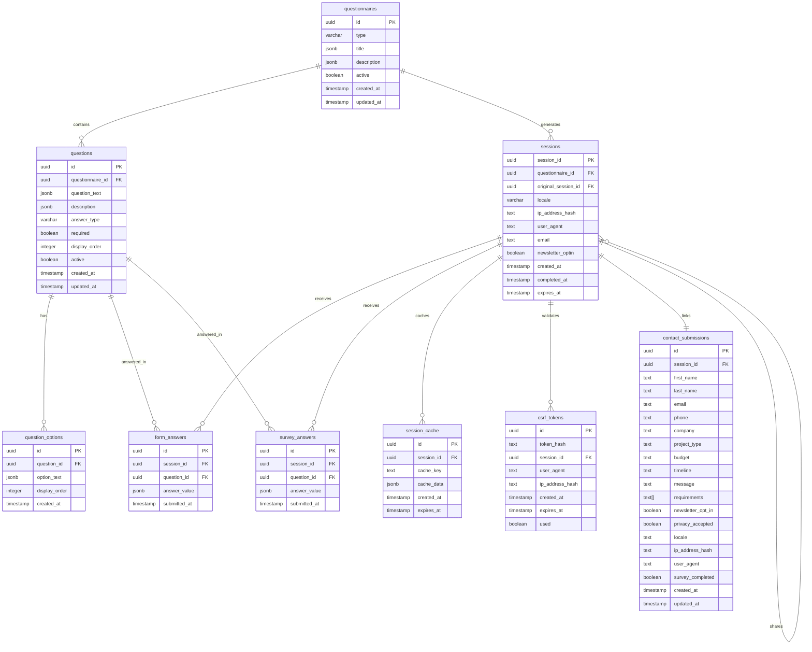

# Unified Survey and Form Database Schema Design

## Overview

This document presents a comprehensive database schema design for a unified survey and form system that eliminates redundancy while supporting independent completion, multilingual content, shareable links with analytics tracking, CSRF protection, and offline continuity.

## Design Principles

1. **Unification**: Merge similar tables for forms and surveys to reduce redundancy
2. **Separation**: Keep form_answers and survey_answers in separate tables for data isolation
3. **Flexibility**: Support multiple question types and answer formats
4. **Internationalization**: Full multilingual support for Czech (cs), English (en), and German (de)
5. **Session Management**: Independent completion with shareable links
6. **Security**: CSRF token validation with database storage
7. **Performance**: Caching support for offline continuity
8. **Analytics**: Track session relationships for shareable link usage

## Database Schema

### Core Tables

#### 1. questionnaires

Stores both form and survey questionnaires as unified entities.

```sql
CREATE TABLE questionnaires (
  id UUID PRIMARY KEY DEFAULT gen_random_uuid(),
  type VARCHAR(10) NOT NULL CHECK (type IN ('form', 'survey')),
  title JSONB NOT NULL, -- {en: "...", cs: "...", de: "..."}
  description JSONB, -- {en: "...", cs: "...", de: "..."}
  active BOOLEAN NOT NULL DEFAULT true,
  created_at TIMESTAMP WITH TIME ZONE DEFAULT NOW(),
  updated_at TIMESTAMP WITH TIME ZONE DEFAULT NOW()
);

COMMENT ON TABLE questionnaires IS 'Unified table for both forms and surveys';
COMMENT ON COLUMN questionnaires.type IS 'Type: form or survey';
COMMENT ON COLUMN questionnaires.title IS 'Multilingual title in JSONB format';
COMMENT ON COLUMN questionnaires.description IS 'Multilingual description in JSONB format';
```

#### 2. questions

Stores all questions for both forms and surveys.

```sql
CREATE TABLE questions (
  id UUID PRIMARY KEY DEFAULT gen_random_uuid(),
  questionnaire_id UUID NOT NULL REFERENCES questionnaires(id) ON DELETE CASCADE,
  question_text JSONB NOT NULL, -- {en: "...", cs: "...", de: "..."}
  description JSONB, -- {en: "...", cs: "...", de: "..."}
  answer_type VARCHAR(20) NOT NULL CHECK (answer_type IN ('short_text', 'long_text', 'single_choice', 'multiple_choice', 'checklist', 'rating')),
  required BOOLEAN NOT NULL DEFAULT false,
  display_order INTEGER NOT NULL,
  active BOOLEAN NOT NULL DEFAULT true,
  created_at TIMESTAMP WITH TIME ZONE DEFAULT NOW(),
  updated_at TIMESTAMP WITH TIME ZONE DEFAULT NOW(),
  UNIQUE(questionnaire_id, display_order)
);

COMMENT ON TABLE questions IS 'Questions for both forms and surveys';
COMMENT ON COLUMN questions.question_text IS 'Multilingual question text in JSONB format';
COMMENT ON COLUMN questions.answer_type IS 'Type: short_text, long_text, single_choice, multiple_choice, checklist, rating';
```

#### 3. question_options

Stores options for choice-based questions.

```sql
CREATE TABLE question_options (
  id UUID PRIMARY KEY DEFAULT gen_random_uuid(),
  question_id UUID NOT NULL REFERENCES questions(id) ON DELETE CASCADE,
  option_text JSONB NOT NULL, -- {en: "...", cs: "...", de: "..."}
  display_order INTEGER NOT NULL,
  created_at TIMESTAMP WITH TIME ZONE DEFAULT NOW(),
  UNIQUE(question_id, display_order)
);

COMMENT ON TABLE question_options IS 'Options for choice-based questions';
COMMENT ON COLUMN question_options.option_text IS 'Multilingual option text in JSONB format';
```

#### 4. sessions

Manages session state for both forms and surveys with shareable link support.

```sql
CREATE TABLE sessions (
  session_id UUID PRIMARY KEY DEFAULT gen_random_uuid(),
  questionnaire_id UUID NOT NULL REFERENCES questionnaires(id) ON DELETE CASCADE,
  original_session_id UUID REFERENCES sessions(session_id), -- For shareable link analytics
  locale VARCHAR(5) NOT NULL DEFAULT 'en' CHECK (locale IN ('en', 'cs', 'de')),
  ip_address_hash TEXT,
  user_agent TEXT,
  email TEXT, -- Optional for forms
  newsletter_optin BOOLEAN DEFAULT false,
  created_at TIMESTAMP WITH TIME ZONE DEFAULT NOW(),
  completed_at TIMESTAMP WITH TIME ZONE,
  expires_at TIMESTAMP WITH TIME ZONE DEFAULT (NOW() + INTERVAL '24 hours')
);

COMMENT ON TABLE sessions IS 'Session management for forms and surveys';
COMMENT ON COLUMN sessions.original_session_id IS 'Reference to original session for shareable link analytics';
COMMENT ON COLUMN sessions.expires_at IS 'Session expiration time (24 hours default)';
```

#### 5. form_answers

Stores answers specifically for forms.

```sql
CREATE TABLE form_answers (
  id UUID PRIMARY KEY DEFAULT gen_random_uuid(),
  session_id UUID NOT NULL REFERENCES sessions(session_id) ON DELETE CASCADE,
  question_id UUID NOT NULL REFERENCES questions(id) ON DELETE CASCADE,
  answer_value JSONB NOT NULL, -- Can be string, array, or number
  submitted_at TIMESTAMP WITH TIME ZONE DEFAULT NOW(),
  UNIQUE(session_id, question_id)
);

COMMENT ON TABLE form_answers IS 'Answers for forms only';
COMMENT ON COLUMN form_answers.answer_value IS 'Answer value in JSONB format (string, array, or number)';
```

#### 6. survey_answers

Stores answers specifically for surveys.

```sql
CREATE TABLE survey_answers (
  id UUID PRIMARY KEY DEFAULT gen_random_uuid(),
  session_id UUID NOT NULL REFERENCES sessions(session_id) ON DELETE CASCADE,
  question_id UUID NOT NULL REFERENCES questions(id) ON DELETE CASCADE,
  answer_value JSONB NOT NULL, -- Can be string, array, or number
  submitted_at TIMESTAMP WITH TIME ZONE DEFAULT NOW(),
  UNIQUE(session_id, question_id)
);

COMMENT ON TABLE survey_answers IS 'Answers for surveys only';
COMMENT ON COLUMN survey_answers.answer_value IS 'Answer value in JSONB format (string, array, or number)';
```

### Security Tables

#### 7. csrf_tokens

Stores CSRF tokens with expiration for security validation.

```sql
CREATE TABLE csrf_tokens (
  id UUID PRIMARY KEY DEFAULT gen_random_uuid(),
  token_hash TEXT NOT NULL UNIQUE,
  session_id UUID REFERENCES sessions(session_id) ON DELETE CASCADE,
  user_agent TEXT,
  ip_address_hash TEXT,
  created_at TIMESTAMP WITH TIME ZONE DEFAULT NOW(),
  expires_at TIMESTAMP WITH TIME ZONE NOT NULL DEFAULT (NOW() + INTERVAL '1 hour'),
  used BOOLEAN NOT NULL DEFAULT false
);

COMMENT ON TABLE csrf_tokens IS 'CSRF tokens for security validation';
COMMENT ON COLUMN csrf_tokens.token_hash IS 'Hashed CSRF token for security';
COMMENT ON COLUMN csrf_tokens.expires_at IS 'Token expiration time (1 hour default)';
```

### Caching Tables

#### 8. session_cache

Stores cached session data for offline continuity.

```sql
CREATE TABLE session_cache (
  id UUID PRIMARY KEY DEFAULT gen_random_uuid(),
  session_id UUID NOT NULL REFERENCES sessions(session_id) ON DELETE CASCADE,
  cache_key TEXT NOT NULL,
  cache_data JSONB NOT NULL,
  created_at TIMESTAMP WITH TIME ZONE DEFAULT NOW(),
  expires_at TIMESTAMP WITH TIME ZONE NOT NULL DEFAULT (NOW() + INTERVAL '24 hours'),
  UNIQUE(session_id, cache_key)
);

COMMENT ON TABLE session_cache IS 'Cached session data for offline continuity';
COMMENT ON COLUMN session_cache.cache_key IS 'Cache key for data identification';
COMMENT ON COLUMN session_cache.cache_data IS 'Cached data in JSONB format';
COMMENT ON COLUMN session_cache.expires_at IS 'Cache expiration time (24 hours default)';
```

### Supporting Tables

#### 9. contact_submissions

Maintains contact form submissions linked to sessions.

```sql
CREATE TABLE contact_submissions (
  id UUID PRIMARY KEY DEFAULT gen_random_uuid(),
  session_id UUID NOT NULL UNIQUE REFERENCES sessions(session_id) ON DELETE CASCADE,
  first_name TEXT NOT NULL,
  last_name TEXT NOT NULL,
  email TEXT NOT NULL,
  phone TEXT NOT NULL,
  company TEXT,
  project_type TEXT NOT NULL,
  budget TEXT NOT NULL,
  timeline TEXT NOT NULL,
  message TEXT NOT NULL,
  requirements TEXT[],
  newsletter_opt_in BOOLEAN NOT NULL DEFAULT false,
  privacy_accepted BOOLEAN NOT NULL DEFAULT true,
  locale TEXT NOT NULL DEFAULT 'en',
  ip_address_hash TEXT,
  user_agent TEXT,
  survey_completed BOOLEAN NOT NULL DEFAULT false,
  created_at TIMESTAMP WITH TIME ZONE DEFAULT NOW(),
  updated_at TIMESTAMP WITH TIME ZONE DEFAULT NOW()
);

COMMENT ON TABLE contact_submissions IS 'Contact form submissions linked to sessions';
```

#### 10. newsletter_subscribers

Manages newsletter subscriptions.

```sql
CREATE TABLE newsletter_subscribers (
  id UUID PRIMARY KEY DEFAULT gen_random_uuid(),
  email TEXT NOT NULL UNIQUE,
  first_name TEXT,
  last_name TEXT,
  locale TEXT NOT NULL DEFAULT 'en',
  subscribed_at TIMESTAMP WITH TIME ZONE DEFAULT NOW(),
  unsubscribed_at TIMESTAMP WITH TIME ZONE,
  active BOOLEAN NOT NULL DEFAULT true,
  source TEXT NOT NULL DEFAULT 'website',
  created_at TIMESTAMP WITH TIME ZONE DEFAULT NOW()
);

COMMENT ON TABLE newsletter_subscribers IS 'Newsletter subscription management';
```

#### 11. cookie_consents

Tracks cookie consent for GDPR compliance.

```sql
CREATE TABLE cookie_consents (
  id UUID PRIMARY KEY DEFAULT gen_random_uuid(),
  session_id TEXT NOT NULL,
  ip_address_hash TEXT NOT NULL,
  user_agent TEXT,
  consent_timestamp TIMESTAMP WITH TIME ZONE DEFAULT NOW(),
  consent_version INTEGER NOT NULL DEFAULT 1,
  essential_cookies BOOLEAN NOT NULL DEFAULT true,
  analytics_cookies BOOLEAN NOT NULL DEFAULT false,
  marketing_cookies BOOLEAN NOT NULL DEFAULT false,
  preferences_cookies BOOLEAN NOT NULL DEFAULT false,
  created_at TIMESTAMP WITH TIME ZONE DEFAULT NOW(),
  updated_at TIMESTAMP WITH TIME ZONE DEFAULT NOW()
);

COMMENT ON TABLE cookie_consents IS 'Cookie consent tracking for GDPR compliance';
```

#### 12. projects

Project gallery with multilingual support.

```sql
CREATE TABLE projects (
  id UUID PRIMARY KEY DEFAULT gen_random_uuid(),
  title JSONB NOT NULL, -- {en: "...", cs: "...", de: "..."}
  description JSONB NOT NULL, -- {en: "...", cs: "...", de: "..."}
  short_description JSONB, -- {en: "...", cs: "...", de: "..."}
  image_url TEXT NOT NULL,
  github_link TEXT,
  live_demo_link TEXT,
  technologies TEXT[] NOT NULL DEFAULT '{}',
  status TEXT NOT NULL DEFAULT 'active' CHECK (status IN ('active', 'completed', 'archived')),
  display_order INTEGER NOT NULL UNIQUE,
  featured BOOLEAN NOT NULL DEFAULT false,
  visible BOOLEAN NOT NULL DEFAULT true,
  created_at TIMESTAMP WITH TIME ZONE DEFAULT NOW(),
  updated_at TIMESTAMP WITH TIME ZONE DEFAULT NOW()
);

COMMENT ON TABLE projects IS 'Project gallery with multilingual support';
```

## Relationship Diagram



## Indexes for Performance

```sql
-- Questionnaires
CREATE INDEX idx_questionnaires_type ON questionnaires(type);
CREATE INDEX idx_questionnaires_active ON questionnaires(active);

-- Questions
CREATE INDEX idx_questions_questionnaire_id ON questions(questionnaire_id);
CREATE INDEX idx_questions_display_order ON questions(display_order);
CREATE INDEX idx_questions_active ON questions(active);

-- Question Options
CREATE INDEX idx_question_options_question_id ON question_options(question_id);
CREATE INDEX idx_question_options_display_order ON question_options(display_order);

-- Sessions
CREATE INDEX idx_sessions_questionnaire_id ON sessions(questionnaire_id);
CREATE INDEX idx_sessions_original_session_id ON sessions(original_session_id);
CREATE INDEX idx_sessions_locale ON sessions(locale);
CREATE INDEX idx_sessions_created_at ON sessions(created_at);
CREATE INDEX idx_sessions_completed_at ON sessions(completed_at);
CREATE INDEX idx_sessions_expires_at ON sessions(expires_at);

-- Form Answers
CREATE INDEX idx_form_answers_session_id ON form_answers(session_id);
CREATE INDEX idx_form_answers_question_id ON form_answers(question_id);
CREATE INDEX idx_form_answers_submitted_at ON form_answers(submitted_at);

-- Survey Answers
CREATE INDEX idx_survey_answers_session_id ON survey_answers(session_id);
CREATE INDEX idx_survey_answers_question_id ON survey_answers(question_id);
CREATE INDEX idx_survey_answers_submitted_at ON survey_answers(submitted_at);

-- CSRF Tokens
CREATE INDEX idx_csrf_tokens_token_hash ON csrf_tokens(token_hash);
CREATE INDEX idx_csrf_tokens_session_id ON csrf_tokens(session_id);
CREATE INDEX idx_csrf_tokens_expires_at ON csrf_tokens(expires_at);
CREATE INDEX idx_csrf_tokens_used ON csrf_tokens(used);

-- Session Cache
CREATE INDEX idx_session_cache_session_id ON session_cache(session_id);
CREATE INDEX idx_session_cache_cache_key ON session_cache(cache_key);
CREATE INDEX idx_session_cache_expires_at ON session_cache(expires_at);

-- Contact Submissions
CREATE INDEX idx_contact_submissions_session_id ON contact_submissions(session_id);
CREATE INDEX idx_contact_submissions_email ON contact_submissions(email);
CREATE INDEX idx_contact_submissions_created_at ON contact_submissions(created_at);

-- Newsletter Subscribers
CREATE INDEX idx_newsletter_subscribers_email ON newsletter_subscribers(email);
CREATE INDEX idx_newsletter_subscribers_active ON newsletter_subscribers(active);

-- Cookie Consents
CREATE INDEX idx_cookie_consents_session_id ON cookie_consents(session_id);
CREATE INDEX idx_cookie_consents_created_at ON cookie_consents(created_at);

-- Projects
CREATE INDEX idx_projects_display_order ON projects(display_order);
CREATE INDEX idx_projects_visible ON projects(visible);
CREATE INDEX idx_projects_featured ON projects(featured);
```

## Triggers for Timestamps

```sql
-- Create function to update updated_at column
CREATE OR REPLACE FUNCTION update_updated_at_column()
RETURNS TRIGGER AS $$
BEGIN
  NEW.updated_at = NOW();
  RETURN NEW;
END;
$$ LANGUAGE plpgsql;

-- Create triggers for tables with updated_at columns
CREATE TRIGGER update_questionnaires_updated_at
BEFORE UPDATE ON questionnaires
FOR EACH ROW
EXECUTE FUNCTION update_updated_at_column();

CREATE TRIGGER update_questions_updated_at
BEFORE UPDATE ON questions
FOR EACH ROW
EXECUTE FUNCTION update_updated_at_column();

CREATE TRIGGER update_contact_submissions_updated_at
BEFORE UPDATE ON contact_submissions
FOR EACH ROW
EXECUTE FUNCTION update_updated_at_column();

CREATE TRIGGER update_cookie_consents_updated_at
BEFORE UPDATE ON cookie_consents
FOR EACH ROW
EXECUTE FUNCTION update_updated_at_column();

CREATE TRIGGER update_projects_updated_at
BEFORE UPDATE ON projects
FOR EACH ROW
EXECUTE FUNCTION update_updated_at_column();
```

## Row Level Security (RLS) Policies

```sql
-- Enable RLS on all tables
ALTER TABLE questionnaires ENABLE ROW LEVEL SECURITY;
ALTER TABLE questions ENABLE ROW LEVEL SECURITY;
ALTER TABLE question_options ENABLE ROW LEVEL SECURITY;
ALTER TABLE sessions ENABLE ROW LEVEL SECURITY;
ALTER TABLE form_answers ENABLE ROW LEVEL SECURITY;
ALTER TABLE survey_answers ENABLE ROW LEVEL SECURITY;
ALTER TABLE csrf_tokens ENABLE ROW LEVEL SECURITY;
ALTER TABLE session_cache ENABLE ROW LEVEL SECURITY;
ALTER TABLE contact_submissions ENABLE ROW LEVEL SECURITY;
ALTER TABLE newsletter_subscribers ENABLE ROW LEVEL SECURITY;
ALTER TABLE cookie_consents ENABLE ROW LEVEL SECURITY;
ALTER TABLE projects ENABLE ROW LEVEL SECURITY;

-- Questionnaires policies
CREATE POLICY "Public can read active questionnaires"
ON questionnaires FOR SELECT
TO anon, authenticated
USING (active = true);

-- Questions policies
CREATE POLICY "Public can read active questions"
ON questions FOR SELECT
TO anon, authenticated
USING (active = true);

-- Question Options policies
CREATE POLICY "Public can read question options"
ON question_options FOR SELECT
TO anon, authenticated
USING (true);

-- Sessions policies
CREATE POLICY "Public can create sessions"
ON sessions FOR INSERT
TO anon, authenticated
WITH CHECK (true);

CREATE POLICY "Public can update own sessions"
ON sessions FOR UPDATE
TO anon, authenticated
USING (true);

CREATE POLICY "Public can read sessions"
ON sessions FOR SELECT
TO anon, authenticated
USING (true);

-- Form Answers policies
CREATE POLICY "Public can create form answers"
ON form_answers FOR INSERT
TO anon, authenticated
WITH CHECK (true);

CREATE POLICY "Public can read own form answers"
ON form_answers FOR SELECT
TO anon, authenticated
USING (true);

-- Survey Answers policies
CREATE POLICY "Public can create survey answers"
ON survey_answers FOR INSERT
TO anon, authenticated
WITH CHECK (true);

CREATE POLICY "Public can read own survey answers"
ON survey_answers FOR SELECT
TO anon, authenticated
USING (true);

-- CSRF Tokens policies
CREATE POLICY "Public can create csrf tokens"
ON csrf_tokens FOR INSERT
TO anon, authenticated
WITH CHECK (true);

CREATE POLICY "Public can validate csrf tokens"
ON csrf_tokens FOR SELECT
TO anon, authenticated
USING (true);

CREATE POLICY "Public can update csrf tokens"
ON csrf_tokens FOR UPDATE
TO anon, authenticated
USING (true);

-- Session Cache policies
CREATE POLICY "Public can create session cache"
ON session_cache FOR INSERT
TO anon, authenticated
WITH CHECK (true);

CREATE POLICY "Public can read own session cache"
ON session_cache FOR SELECT
TO anon, authenticated
USING (true);

CREATE POLICY "Public can update session cache"
ON session_cache FOR UPDATE
TO anon, authenticated
USING (true);

-- Contact Submissions policies
CREATE POLICY "Public can create contact submissions"
ON contact_submissions FOR INSERT
TO anon, authenticated
WITH CHECK (true);

CREATE POLICY "Public can update contact submissions"
ON contact_submissions FOR UPDATE
TO anon, authenticated
USING (true);

-- Newsletter policies
CREATE POLICY "Public can subscribe to newsletter"
ON newsletter_subscribers FOR INSERT
TO anon, authenticated
WITH CHECK (true);

-- Cookie Consent policies
CREATE POLICY "Public can create cookie consents"
ON cookie_consents FOR INSERT
TO anon, authenticated
WITH CHECK (true);

CREATE POLICY "Public can update cookie consents"
ON cookie_consents FOR UPDATE
TO anon, authenticated
USING (true);

-- Project Gallery policies
CREATE POLICY "Public can read visible projects"
ON projects FOR SELECT
TO anon, authenticated
USING (visible = true);
```

## Seed Data Structure

### Form Questionnaire

```sql
-- Insert form questionnaire
INSERT INTO questionnaires (type, title, description)
VALUES (
  'form',
  '{"en": "Customer Satisfaction Form", "cs": "Formulář spokojenosti zákazníků", "de": "Kundenzufriedenheitsformular"}'::jsonb,
  '{"en": "Help us improve our services by sharing your feedback", "cs": "Pomozte nám zlepšit naše služby sdílením vaší zpětné vazby", "de": "Helfen Sie uns, unsere Dienstleistungen zu verbessern, indem Sie Ihr Feedback teilen"}'::jsonb
) RETURNING id;
```

### Survey Questionnaire

```sql
-- Insert survey questionnaire
INSERT INTO questionnaires (type, title, description)
VALUES (
  'survey',
  '{"en": "Post-Contact Survey", "cs": "Průzkum po kontaktu", "de": "Nach-Kontakt-Umfrage"}'::jsonb,
  '{"en": "Share your experience with our initial response", "cs": "Sdílejte své zkušenosti s naší počáteční odpovědí", "de": "Teilen Sie Ihre Erfahrung mit unserer ersten Antwort"}'::jsonb
) RETURNING id;
```

### Sample Questions with Multilingual Support

```sql
-- Form Questions (4 sample questions)
DO $$
DECLARE
  form_questionnaire_id UUID;
BEGIN
  SELECT id INTO form_questionnaire_id FROM questionnaires WHERE type = 'form' LIMIT 1;

  -- Question 1: Rating
  INSERT INTO questions (questionnaire_id, question_text, description, answer_type, required, display_order)
  VALUES (
    form_questionnaire_id,
    '{"en": "How would you rate your overall experience?", "cs": "Jak byste ohodnotili svou celkovou zkušenost?", "de": "Wie würden Sie Ihre Gesamterfahrung bewerten?"}'::jsonb,
    '{"en": "Rate from 1 (poor) to 5 (excellent)", "cs": "Ohodnoťte od 1 (špatné) do 5 (výborné)", "de": "Bewerten Sie von 1 (schlecht) bis 5 (ausgezeichnet)"}'::jsonb,
    'rating',
    true,
    1
  );

  -- Question 2: Checklist
  INSERT INTO questions (questionnaire_id, question_text, description, answer_type, required, display_order)
  VALUES (
    form_questionnaire_id,
    '{"en": "What did you like most about our service?", "cs": "Co se vám na naší službě nejvíce líbilo?", "de": "Was hat Ihnen an unserem Service am besten gefallen?"}'::jsonb,
    '{"en": "Select all that apply", "cs": "Vyberte vše, co platí", "de": "Wählen Sie alle zutreffenden aus"}'::jsonb,
    'checklist',
    true,
    2
  ) RETURNING id INTO form_questionnaire_id;

  -- Add options for checklist question
  INSERT INTO question_options (question_id, option_text, display_order) VALUES
    (form_questionnaire_id, '{"en": "Quality of work", "cs": "Kvalita práce", "de": "Arbeitsqualität"}'::jsonb, 1),
    (form_questionnaire_id, '{"en": "Communication", "cs": "Komunikace", "de": "Kommunikation"}'::jsonb, 2),
    (form_questionnaire_id, '{"en": "Timeliness", "cs": "Včasnost", "de": "Pünktlichkeit"}'::jsonb, 3),
    (form_questionnaire_id, '{"en": "Pricing", "cs": "Ceny", "de": "Preisgestaltung"}'::jsonb, 4),
    (form_questionnaire_id, '{"en": "Technical expertise", "cs": "Technická odbornost", "de": "Technisches Fachwissen"}'::jsonb, 5);

  -- Question 3: Single choice
  INSERT INTO questions (questionnaire_id, question_text, description, answer_type, required, display_order)
  VALUES (
    form_questionnaire_id,
    '{"en": "Would you recommend us to others?", "cs": "Doporučili byste nás ostatním?", "de": "Würden Sie uns anderen empfehlen?"}'::jsonb,
    NULL,
    'single_choice',
    true,
    3
  ) RETURNING id INTO form_questionnaire_id;

  -- Add options for single choice question
  INSERT INTO question_options (question_id, option_text, display_order) VALUES
    (form_questionnaire_id, '{"en": "Definitely", "cs": "Rozhodně", "de": "Auf jeden Fall"}'::jsonb, 1),
    (form_questionnaire_id, '{"en": "Probably", "cs": "Pravděpodobně", "de": "Wahrscheinlich"}'::jsonb, 2),
    (form_questionnaire_id, '{"en": "Not sure", "cs": "Nejsem si jistý", "de": "Nicht sicher"}'::jsonb, 3),
    (form_questionnaire_id, '{"en": "Probably not", "cs": "Pravděpodobně ne", "de": "Wahrscheinlich nicht"}'::jsonb, 4),
    (form_questionnaire_id, '{"en": "Definitely not", "cs": "Rozhodně ne", "de": "Auf keinen Fall"}'::jsonb, 5);

  -- Question 4: Long text
  INSERT INTO questions (questionnaire_id, question_text, description, answer_type, required, display_order)
  VALUES (
    form_questionnaire_id,
    '{"en": "Any additional feedback?", "cs": "Nějaká další zpětná vazba?", "de": "Zusätzliches Feedback?"}'::jsonb,
    '{"en": "Share your thoughts with us", "cs": "Podělte se s námi o své myšlenky", "de": "Teilen Sie uns Ihre Gedanken mit"}'::jsonb,
    'long_text',
    false,
    4
  );
END $$;
```

## Migration Strategy

### Step 1: Backup Existing Data

```sql
-- Create backup tables for existing data
CREATE TABLE backup_form_responses AS SELECT * FROM form_responses;
CREATE TABLE backup_survey_responses AS SELECT * FROM survey_responses;
CREATE TABLE backup_form_sessions AS SELECT * FROM form_sessions;
CREATE TABLE backup_survey_sessions AS SELECT * FROM survey_sessions;
CREATE TABLE backup_questions AS SELECT * FROM questions;
CREATE TABLE backup_survey_questions AS SELECT * FROM survey_questions;
CREATE TABLE backup_question_options AS SELECT * FROM question_options;
CREATE TABLE backup_survey_question_options AS SELECT * FROM survey_question_options;
```

### Step 2: Drop Old Tables

```sql
-- Drop old tables in reverse order of dependencies
DROP TABLE IF EXISTS form_responses CASCADE;
DROP TABLE IF EXISTS survey_responses CASCADE;
DROP TABLE IF EXISTS form_sessions CASCADE;
DROP TABLE IF EXISTS survey_sessions CASCADE;
DROP TABLE IF EXISTS question_options CASCADE;
DROP TABLE IF EXISTS survey_question_options CASCADE;
DROP TABLE IF EXISTS questions CASCADE;
DROP TABLE IF EXISTS survey_questions CASCADE;
```

### Step 3: Create New Unified Schema

Execute all the CREATE TABLE statements provided above in the correct order.

### Step 4: Migrate Data

```sql
-- Migrate form questions to unified questions table
INSERT INTO questions (id, questionnaire_id, question_text, description, answer_type, required, display_order, active, created_at, updated_at)
SELECT
  q.id,
  (SELECT id FROM questionnaires WHERE type = 'form' LIMIT 1),
  q.question_text,
  q.description,
  q.answer_type,
  q.required,
  q.display_order,
  q.active,
  q.created_at,
  q.updated_at
FROM backup_questions q;

-- Migrate survey questions to unified questions table
INSERT INTO questions (id, questionnaire_id, question_text, description, answer_type, required, display_order, active, created_at, updated_at)
SELECT
  sq.id,
  (SELECT id FROM questionnaires WHERE type = 'survey' LIMIT 1),
  sq.question_text,
  sq.description,
  sq.answer_type,
  sq.required,
  sq.display_order,
  sq.active,
  sq.created_at,
  sq.updated_at
FROM backup_survey_questions sq;

-- Migrate question options
INSERT INTO question_options (id, question_id, option_text, display_order, created_at)
SELECT id, question_id, option_text, display_order, created_at FROM backup_question_options;

INSERT INTO question_options (id, question_id, option_text, display_order, created_at)
SELECT id, question_id, option_text, display_order, created_at FROM backup_survey_question_options;

-- Migrate sessions
INSERT INTO sessions (session_id, questionnaire_id, locale, ip_address_hash, user_agent, email, newsletter_optin, created_at, completed_at)
SELECT
  session_id,
  (SELECT id FROM questionnaires WHERE type = 'form' LIMIT 1),
  locale,
  ip_address_hash,
  user_agent,
  email,
  newsletter_optin,
  created_at,
  completed_at
FROM backup_form_sessions;

INSERT INTO sessions (session_id, questionnaire_id, locale, ip_address_hash, user_agent, created_at, completed_at)
SELECT
  s.session_id,
  (SELECT id FROM questionnaires WHERE type = 'survey' LIMIT 1),
  s.locale,
  s.ip_address_hash,
  s.user_agent,
  s.created_at,
  s.completed_at
FROM backup_survey_sessions s;

-- Migrate form answers
INSERT INTO form_answers (id, session_id, question_id, answer_value, submitted_at)
SELECT fr.id, fr.session_id, fr.question_id, fr.answer_value, fr.submitted_at
FROM backup_form_responses fr
JOIN form_sessions fs ON fr.session_id = fs.session_id;

-- Migrate survey answers
INSERT INTO survey_answers (id, session_id, question_id, answer_value, submitted_at)
SELECT sr.id, sr.session_id, sr.question_id, sr.answer_value, sr.submitted_at
FROM backup_survey_responses sr
JOIN survey_sessions ss ON sr.session_id = ss.session_id;
```

### Step 5: Verification

```sql
-- Display table counts after migration
SELECT
  'questionnaires' as table_name, COUNT(*) as row_count FROM questionnaires
UNION ALL
SELECT 'questions', COUNT(*) FROM questions
UNION ALL
SELECT 'question_options', COUNT(*) FROM question_options
UNION ALL
SELECT 'sessions', COUNT(*) FROM sessions
UNION ALL
SELECT 'form_answers', COUNT(*) FROM form_answers
UNION ALL
SELECT 'survey_answers', COUNT(*) FROM survey_answers
UNION ALL
SELECT 'csrf_tokens', COUNT(*) FROM csrf_tokens
UNION ALL
SELECT 'session_cache', COUNT(*) FROM session_cache
UNION ALL
SELECT 'contact_submissions', COUNT(*) FROM contact_submissions
UNION ALL
SELECT 'newsletter_subscribers', COUNT(*) FROM newsletter_subscribers
UNION ALL
SELECT 'cookie_consents', COUNT(*) FROM cookie_consents
UNION ALL
SELECT 'projects', COUNT(*) FROM projects
ORDER BY table_name;
```

## API Implementation Notes

### Session Management

- Sessions automatically expire after 24 hours
- Shareable links create new sessions with `original_session_id` reference
- Sessions are tied to specific questionnaires (form or survey)

### Multilingual Content

- All user-facing text stored as JSONB with keys: en, cs, de
- API endpoints return content based on requested locale
- Fallback to English if requested locale translation is missing

### Question Types

- `short_text`: Single line text input
- `long_text`: Multi-line text input
- `single_choice`: Select one option
- `multiple_choice`: Select multiple options
- `checklist`: Select multiple options (checkboxes)
- `rating`: Numeric rating (1-5)

### Answer Storage

- Form answers stored in `form_answers` table
- Survey answers stored in `survey_answers` table
- All answers stored as JSONB for flexibility
- Text answers: stored as strings
- Choice answers: stored as arrays of selected option IDs
- Rating answers: stored as numbers

### CSRF Protection

- CSRF tokens stored in dedicated table with 1-hour expiration
- Tokens validated against session and user agent
- Automatic cleanup of expired tokens

### Caching Strategy

- Session data cached in `session_cache` table for 24 hours
- Enables offline continuity
- Automatic cleanup of expired cache entries

## Shareable Link Implementation

### Flow

1. User completes original session (form or survey)
2. System generates shareable link: `/form/join?session_id=UUID` or `/survey/join?session_id=UUID`
3. New user clicks shareable link
4. System creates new session with:
   - `original_session_id` pointing to the original
   - Same `questionnaire_id` as original
   - New generated `session_id`
5. New user completes independently

### Analytics

- Track how many sessions originate from each shareable link
- Measure conversion rates and engagement
- Understand sharing patterns

## Benefits of This Design

1. **Reduced Redundancy**: Unified tables eliminate duplicate structures
2. **Data Separation**: Separate form_answers and survey_answers tables for data isolation
3. **Flexibility**: Easy to add new questionnaire types
4. **Scalability**: Efficient queries with proper indexing
5. **Internationalization**: Built-in multilingual support
6. **Security**: CSRF token validation with database storage
7. **Performance**: Caching support for offline continuity
8. **Analytics**: Trackable sharing mechanisms
9. **Row-level Security**: Proper RLS policies in place
10. **Performance**: Optimized indexes for common query patterns

## TypeScript Interface Updates

The existing TypeScript interfaces in [`src/app/lib/supabase.ts`](src/app/lib/supabase.ts:1) will need to be updated to match the new unified schema:

```typescript
// New interfaces for unified system
export interface Questionnaire {
  id: string;
  type: "form" | "survey";
  title: LocalizedString;
  description?: LocalizedString | null;
  active: boolean;
  created_at?: string;
  updated_at?: string;
}

export interface Question {
  id: string;
  questionnaire_id: string;
  question_text: LocalizedString;
  description?: LocalizedString | null;
  answer_type:
    | "short_text"
    | "long_text"
    | "single_choice"
    | "multiple_choice"
    | "checklist"
    | "rating";
  required: boolean;
  display_order: number;
  active: boolean;
  created_at?: string;
  updated_at?: string;
  options?: QuestionOption[];
}

export interface Session {
  session_id: string;
  questionnaire_id: string;
  original_session_id?: string | null;
  locale: string;
  email?: string | null;
  newsletter_optin?: boolean;
  created_at?: string;
  completed_at?: string | null;
  expires_at?: string;
  ip_address_hash?: string | null;
  user_agent?: string | null;
}

export interface FormAnswer {
  id?: string;
  session_id: string;
  question_id: string;
  answer_value: AnswerValue;
  submitted_at?: string;
}

export interface SurveyAnswer {
  id?: string;
  session_id: string;
  question_id: string;
  answer_value: AnswerValue;
  submitted_at?: string;
}

export interface CsrfToken {
  id?: string;
  token_hash: string;
  session_id?: string | null;
  user_agent?: string | null;
  ip_address_hash?: string | null;
  created_at?: string;
  expires_at?: string;
  used?: boolean;
}

export interface SessionCache {
  id?: string;
  session_id: string;
  cache_key: string;
  cache_data: any;
  created_at?: string;
  expires_at?: string;
}
```

This comprehensive design provides a robust foundation for the unified survey and form system while maintaining all required functionality and adding new capabilities for security, performance, and analytics.
